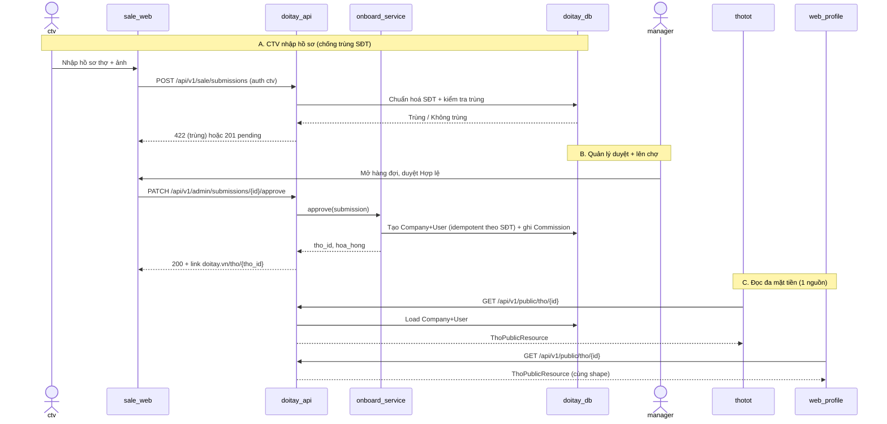

# Sale CTV Onboarding & Multi-Surface Thợ Data — Design Document

This document outlines the architectural design for the **App Sale — CTV nhập & onboard thợ** use case, including the multi-surface data strategy (one source of truth on doitay.vn, read by both the web and the ThợTốt Zalo Mini App).

> **Prerequisite note (design-architecture Step 0):** No dedicated Use Case document exists yet for this feature. Per user direction we proceed using **[BREQ-SALE-CTV-ONBOARDING](../../business/requirements/sale_ctv_onboarding_app.md)** (which carries the FRs, BRs, and acceptance criteria) as the source of truth. Recommended follow-up: formalize a BUC via `document-workflow`.

Reference: [BREQ-SALE-CTV-ONBOARDING](../../business/requirements/sale_ctv_onboarding_app.md)

---

## 1. Entities

_Key data objects created, exchanged, or manipulated during the process._

- **ThoSubmission (Hồ sơ thợ):** Bản ghi thợ do CTV nhập, có vòng đời trạng thái `pending → approved | rejected`. Nguồn để tạo thợ thật trên doitay khi hợp lệ.
- **SubmissionImage (Ảnh công việc):** Ảnh dự án gắn với một ThoSubmission, có cờ `approved` do Quản lý duyệt.
- **Company / User (Thợ doitay):** Bản ghi thợ THẬT trên doitay (bảng `companies` + `users` sẵn có). Được tạo từ ThoSubmission khi duyệt hợp lệ. **Đây là nguồn dữ liệu duy nhất cho mọi mặt tiền.**
- **Commission (Hoa hồng):** Bản ghi hoa hồng gắn 1-1 với ThoSubmission hợp lệ, thuộc về một CTV.
- **CtvUser (CTV):** Tài khoản CTV (dùng bảng `users` + role `ctv`), có `ma_ctv`.
- **ThoPublicResource:** Hợp đồng dữ liệu (JSON) trả về khi ĐỌC hồ sơ thợ công khai — **cùng một shape cho web `/tho/{id}` và ThợTốt**.

---

## 2. Participants

| Participant | Type | Description |
| :---------- | :--- | :---------- |
| **ctv** | Actor | CTV nhập hồ sơ thợ trên web app mobile |
| **manager** | Actor | Quản lý duyệt ảnh, nghiệm thu, tính công |
| **sale_web** | System | Web app mobile (frontend) cho CTV & Quản lý, gọi doitay API |
| **doitay_api** | Service | Backend Laravel (API/V1) — namespaces Sale, Admin, Public |
| **onboard_service** | Service | Service tạo thợ (Company+User) từ ThoSubmission + ghi Commission (single source of truth) |
| **doitay_db** | System | MySQL — bảng submissions/images/commissions + companies/users sẵn có |
| **thotot** | System | ThợTốt Zalo Mini App — ĐỌC hồ sơ thợ qua Public API (không Firebase) |
| **web_profile** | System | Trang công khai `doitay.vn/tho/{id}` — ĐỌC cùng Public API |

---

## 3. Interaction Flow

### Sequence Diagram — Nhập → Duyệt → Lên chợ → Đọc đa mặt tiền



### Interaction Details

| Step | From | To | Action | Details |
| :--- | :--- | :--- | :--- | :--- |
| A.1 | ctv | sale_web | `Nhập hồ sơ` | Tên, nghề, khu vực, SĐT, năm KN, bảng giá, 3–5 ảnh |
| A.2 | sale_web | doitay_api | `POST /sale/submissions` | Auth sanctum + role `ctv`; multipart ảnh |
| A.3 | doitay_api | doitay_db | `Dedup SĐT` | Chuẩn hoá (+84→0, bỏ khoảng trắng) rồi so với `companies.mobile`/`tho_submissions.sdt_tho` |
| A.4 | doitay_api | sale_web | `201 / 422` | 422 nếu trùng (BR-1); 201 tạo submission `pending` |
| B.1 | manager | doitay_api | `PATCH /admin/submissions/{id}/approve` | Auth admin; đánh dấu ảnh `approved`, kiểm BR-2 |
| B.2 | doitay_api | onboard_service | `approve()` | Điều phối tạo thợ + hoa hồng trong 1 transaction |
| B.3 | onboard_service | doitay_db | `Tạo thợ + commission` | Idempotent theo SĐT (BR-4, NFR-004); Commission 1-1 (BR-3) |
| B.4 | doitay_api | sale_web | `200 + link` | Trả `doitay.vn/tho/{tho_id}` cho CTV đưa thợ |
| C.1 | thotot | doitay_api | `GET /public/tho/{id}` | Không auth; ThợTốt bỏ Firebase (FR-015) |
| C.2 | doitay_api | thotot | `ThoPublicResource` | Đủ field CV: ảnh, kỹ năng, giá, đánh giá (FR-016) |
| C.3 | web_profile | doitay_api | `GET /public/tho/{id}` | Cùng resource → cùng dữ liệu (BR-7) |

---

## 4. Technical Discussion

### 4.1 Security Considerations
- **AuthN/AuthZ:** Sanctum token; role gate `ctv` cho `/sale/*`, `admin` cho `/admin/*`. Public read không auth.
- **Scoping CTV (NFR-003):** `/sale/submissions` luôn filter `where ctv_id = auth()->id()`; CTV không xem/sửa hồ sơ CTV khác.
- **Lộ SĐT (BR/NFR-003):** ThoPublicResource chỉ trả field công khai; SĐT thợ hiển thị theo chính sách hiện có, KHÔNG lộ SĐT của CTV hay dữ liệu nội bộ (trạng thái duyệt, lý do từ chối, commission).
- **Chống lạm dụng upload:** giới hạn số ảnh (≤5), dung lượng, mime image/*; quét ảnh khi duyệt (BR-2).
- **Idempotency:** khoá theo SĐT chuẩn hoá tránh tạo thợ trùng khi retry (NFR-004).

### 4.2 API Design (REST, theo chuẩn API/V1 hiện có)
Tái dùng 3 sub-namespace sẵn có (`Public`, `User/Sale`, `Admin`) trong `core/app/Http/Controllers/API/V1/`.

**Sale (auth:sanctum + role ctv)**
- `POST   /api/v1/sale/submissions` — tạo hồ sơ (multipart ảnh). 422 nếu trùng SĐT.
- `GET    /api/v1/sale/submissions` — danh sách hồ sơ của chính CTV + trạng thái.
- `GET    /api/v1/sale/me/commissions` — hoa hồng của CTV.

**Admin (auth:sanctum + role admin)**
- `GET    /api/v1/admin/submissions?status=pending` — hàng đợi duyệt.
- `PATCH  /api/v1/admin/submissions/{id}/approve` — duyệt hợp lệ → tạo thợ + commission.
- `PATCH  /api/v1/admin/submissions/{id}/reject` — từ chối + lý do.
- `GET    /api/v1/admin/ctv/report?week=...` — dashboard/báo cáo tuần.

**Public (no auth) — hợp đồng đọc đa mặt tiền**
- `GET    /api/v1/public/tho/{id}` — trả `ThoPublicResource` (dùng chung web + ThợTốt). *(Mở rộng resource hiện có của company/tho cho đủ field CV: portfolio, skills, services, reviews.)*

Ví dụ `ThoPublicResource` (rút gọn):
```json
{
  "id": 157, "vanity_slug": "vu-hung",
  "ten": "Vũ Hùng", "nghe": "Thợ điện", "khu_vuc": "Cầu Giấy, Hà Nội",
  "nam_kn": 3, "phone": "0972585990",
  "ky_nang": ["Điện dân dụng", "Lắp đặt"],
  "bang_gia": [{"ten": "Kiểm tra", "gia": "150.000"}],
  "anh_du_an": ["https://doitay.vn/storage/..."],
  "danh_gia": {"diem": 5.0, "so_luong": 5}
}
```

### 4.3 Data Storage
**Bảng mới (MySQL):**
- `tho_submissions` (id, ctv_id, ten_tho, nghe, khu_vuc, sdt_tho, sdt_normalized [unique index để dedup], nam_kn, bang_gia_json, status[pending/approved/rejected], ly_do_tu_choi, company_id[nullable, sau khi tạo], timestamps).
- `submission_images` (id, submission_id, url, approved[bool]).
- `commissions` (id, ctv_id, submission_id[unique], so_tien, loai[base/share_bonus], tuan, timestamps).
- CTV: **tái dùng `users`** + cột/quan hệ role `ctv` + `ma_ctv` (tránh bảng user thứ hai).

**Tái dùng bảng sẵn có:** thợ thật vẫn là `companies` + `users` hiện tại → mọi surface đọc từ đây (không đẻ schema thợ mới).

**Chuẩn hoá SĐT:** hàm chuẩn hoá dùng chung cho cả khi nhập (dedup) và khi tạo thợ; lưu `sdt_normalized` có unique index.

### 4.4 Multi-Surface Strategy & ThợTốt Migration (điểm cốt lõi)
**Nguyên tắc (BR-7):** doitay.vn là **nguồn dữ liệu thợ duy nhất**. ThợTốt + web chỉ là mặt tiền đọc `ThoPublicResource`.

**Đổi ở ThợTốt (Tool_cv):**
- Thay `src/services/firebase.ts` bằng client gọi `GET /api/v1/public/tho/{id}` (bỏ Firestore/Storage cho dữ liệu thợ).
- Map field: `ThoPublicResource → UserProfile` của ThợTốt (bảng dưới).
- `uid` trong ThợTốt = `id` thợ doitay → QR/link `doitay.vn/tho/{id}` nhất quán (đã dùng sẵn trong `QRShareModal`/`Watermark`).

**Field mapping ThợTốt ↔ doitay:**

| ThợTốt (UserProfile) | doitay (ThoPublicResource) |
| :--- | :--- |
| displayName | ten |
| jobTitle | nghe |
| location.city/district | khu_vuc |
| experienceYears | nam_kn |
| skills[] | ky_nang[] |
| servicePrices[] | bang_gia[] |
| projectImages[] | anh_du_an[] |
| customerReviews[] | danh_gia |
| phoneNumber | phone |

**Lợi ích:** một lần sale nhập → thợ có mặt trên cả web `/tho/{id}` lẫn ThợTốt; đồng thời gỡ phụ thuộc Firebase (thứ gây khó khi duyệt Zalo).

---

## 5. Notes & Open Items
- **⚠️ DEFERRED-001 (Firebase→doitay migration):** Phần chuyển ThợTốt sang đọc doitay API (FR-015/016, §4.4) đã **HOÃN** đến sau khi ThợTốt qua duyệt Zalo. Chi tiết & điều kiện kích hoạt lại: [`docs/backlog.md → DEFERRED-001`](../../backlog.md). Phần onboard phía doitay (FR-001..013) vẫn triển khai bình thường.
- **UC hoá formal:** đã tạo BUC [`sale-ctv-onboarding`](../../use_cases/business/sale-ctv-onboarding.md) để chốt AC/EF chi tiết.
- **Sale frontend:** khuyến nghị là khu vực `/sale` (auth) trong Next.js frontend hiện có, tái dùng `lib/api.ts` — không dựng app riêng.
- **Thứ tự làm:** theo phases trong BREQ §12 (MVP nhập+dedup trước; duyệt+lên chợ; hoa hồng+dashboard; rồi migrate ThợTốt đọc API).
