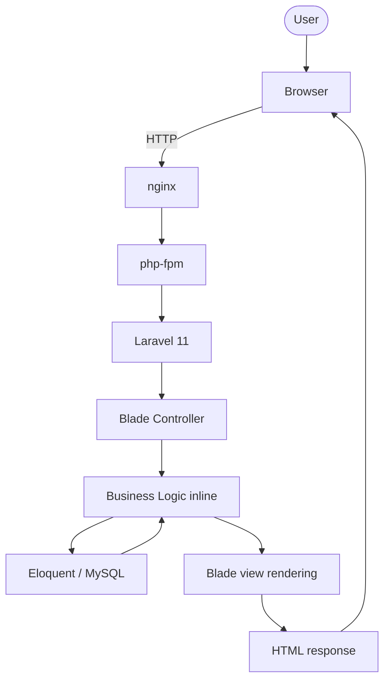
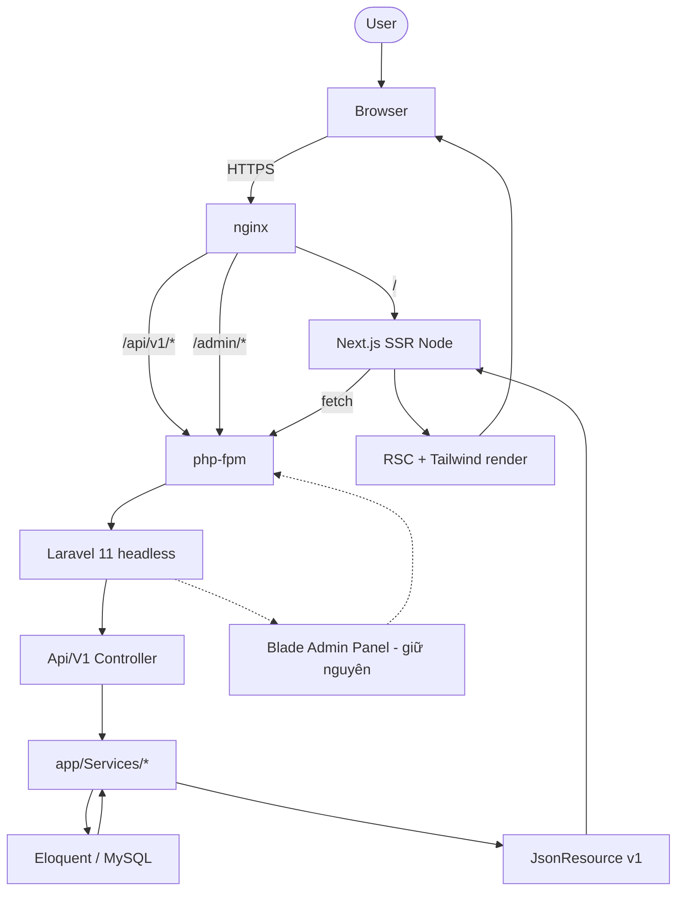
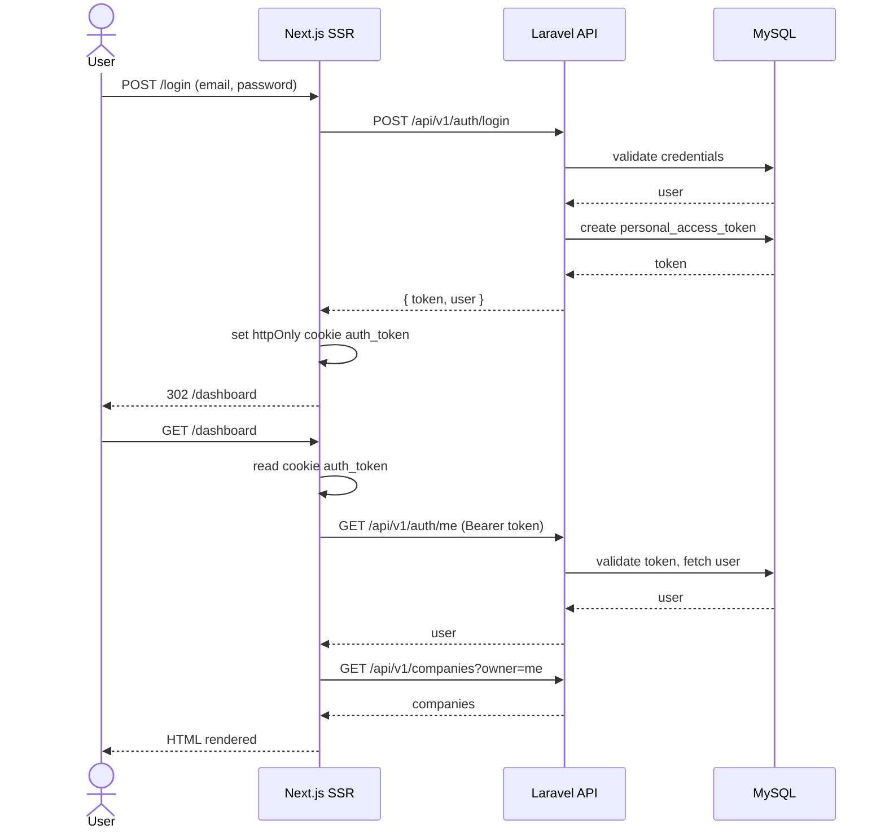
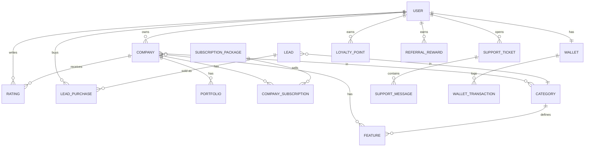

# Business Requirement: Headless Migration của doitay.vn

**Document ID:** BREQ-HEADLESS-MIGRATION
**Date:** 2026-04-11
**Author:** tungtaoday + Claude
**Status:** Draft (chờ user duyệt để chuyển sang Stage 1 — use-cases)

---

## Executive Summary

doitay.vn hiện là một Laravel 11 monolith với toàn bộ UI render bằng Blade (47 Eloquent models, ~1156 dòng route Blade, chỉ 24 dòng `routes/api.php`). Frontend đã cũ về mặt UX, khó cập nhật, không thân thiện mobile, và hạn chế khả năng cung cấp ứng dụng mobile/native trong tương lai.

Đề xuất: **giữ nguyên backend Laravel, chuyển nó thành headless API (`/api/v1/*`), và viết lại toàn bộ frontend public bằng Next.js 15**. Backend kế thừa toàn bộ business logic đã được kiểm chứng (payment, wallet, lead matching, ratings, ticketing). Frontend mới chạy song song với Blade hiện hữu trong giai đoạn cutover từng page theo traffic, không big-bang. Admin panel có thể tiếp tục dùng Blade vĩnh viễn.

Lợi ích kỳ vọng: UX hiện đại, mobile-first, mở đường cho mobile app, giảm rủi ro rewrite vì backend không bị chạm.

---

## 1. Business Context

### 1.1 Current State

- **Stack hiện tại**: Laravel 11 + PHP 8.3, MySQL, Blade views, jQuery/Bootstrap legacy.
- **Code base**: `C:\xampp\htdocs\core` (đang chạy production), repo `github.com/tungtaoday/doitay.vn`. Đã clone về `Strategy/doitay-vn/core`.
- **Phạm vi nghiệp vụ**: Marketplace kết nối khách hàng với nhà thầu/dịch vụ tại Việt Nam. Có rating, lead generation, wallet, subscription, support ticket, loyalty/referral.
- **Quy mô**: 47 Eloquent models, 5 file route (`web.php` 558 dòng, `admin.php` 378, `user.php` 220, `api.php` 24, `ipn.php`), 3 group routes (admin/user/public).
- **Gói đã có sẵn**: `laravel/sanctum`, `laravel/socialite`, `intervention/image`, `mailjet`, `twilio`, `vonage`, `mollie`, `coingate`, `btcpayserver`, `authorizenet` — backend đã rất giàu integration.

### 1.2 Business Objectives

- **OBJ-1**: Hiện đại hoá trải nghiệm người dùng public (homepage, category, company detail, search, đăng ký, rating) trên mobile + desktop.
- **OBJ-2**: Bảo toàn 100% business logic backend đã chạy production — không rewrite payment/wallet/lead matching.
- **OBJ-3**: Bảo toàn SEO organic — URL structure, metadata, sitemap, structured data phải giữ nguyên byte-for-byte trong giai đoạn cutover.
- **OBJ-4**: Tạo nền tảng API (`/api/v1`) cho phép phát triển mobile app native trong tương lai mà không cần rework backend.
- **OBJ-5**: Giảm thời gian phát triển feature mới ở phía FE (decoupled team, deploy độc lập).

### 1.3 Stakeholders

| Stakeholder | Role | Interest/Impact |
|---|---|---|
| Chủ sản phẩm (tungtaoday) | Product Owner | Quyết định ưu tiên, duyệt từng stage gate |
| End user (khách tìm dịch vụ) | Public visitor | UX mới, mobile-first, không bị mất tính năng |
| Nhà thầu / company | Authenticated user | Dashboard, lead management, wallet — cần chạy ổn định trong cutover |
| Admin nội bộ | Operator | Vẫn dùng Blade admin panel — KHÔNG bị ảnh hưởng |
| SEO / organic traffic | — | Rủi ro lớn nhất; cần parity tuyệt đối |
| Dev team tương lai | Frontend devs | Cần stack hiện đại (Next.js + TS) để dễ tuyển và onboard |

---

## 2. Problem Statement

doitay.vn có business logic mạnh nhưng frontend Blade làm hạn chế:
- Khó tạo trải nghiệm mobile mượt (server-render full page mỗi action).
- Không thể tách team FE/BE, mọi thay đổi UI đều phải đụng PHP/Blade.
- Không có nền tảng cho mobile app native (chỉ có 2 endpoint REST).
- Khó áp dụng design system hiện đại, mọi component đều ad-hoc trong Blade partials.

### 2.1 Pain Points

- **PP-1**: Frontend hiện tại không responsive đủ tốt cho thiết bị di động — tỷ lệ bounce mobile cao (cần đo baseline).
- **PP-2**: Mỗi feature UI mới đòi hỏi dev biết Laravel + Blade + jQuery legacy → khó tuyển.
- **PP-3**: Không có REST API → chặn mọi kế hoạch mobile app, third-party integration.
- **PP-4**: Business logic và view rendering trộn lẫn trong cùng controller → khó test, khó tái sử dụng.
- **PP-5**: Asset pipeline cũ (Laravel Mix), không hot-reload tốt, dev experience kém.

### 2.2 Business Impact

*Cần đo baseline trước khi bắt đầu Phase 1 (xem NFR-001).* Các chỉ số cần thu thập:
- Tỷ lệ bounce trên mobile vs desktop.
- Conversion rate đăng ký company / submit rating / mua lead.
- Top 100 page theo organic traffic (Search Console).
- Core Web Vitals (LCP, CLS, INP) hiện tại.

---

## 3. Proposed Solution

### 3.1 Solution Overview

Chuyển Laravel monolith thành **headless backend** + **Next.js SPA frontend**, chạy song song qua nginx routing. Migration theo từng page, ưu tiên page traffic cao nhất, có rollback nhanh trong vài giây bằng cách flip nginx `location` block.

### 3.2 Key Features/Capabilities

- **F1 — REST API v1 trên Laravel**: scaffold `app/Http/Controllers/Api/V1/*` **chia 3 namespace song song với cấu trúc hiện hữu** (`Controllers/Admin`, `Controllers/User`, `Controllers/API`):
  - `Api/V1/Admin/*` — admin panel endpoints, middleware admin guard
  - `Api/V1/User/*` — authenticated company/customer endpoints
  - `Api/V1/Public/*` — public read endpoints (homepage, search, detail), không auth
  - `Api/V1/AuthController.php` — login/register/me/logout dùng chung
  Đi kèm `Resources/V1/{Admin,User,Public}/*` (vì cùng entity nhưng field expose khác nhau theo audience) và `Requests/V1/{Admin,User,Public}/*`. Routes tách file `routes/api/v1_{public,user,admin}.php`. Sanctum PAT auth.
- **F2 — Shared service layer**: extract business logic ra `app/Services/*` để Blade controller cũ và API controller mới cùng dùng (single source of truth).
- **F3 — Next.js 15 frontend**: App Router + TS strict + Tailwind 4 + shadcn/ui, RSC cho reads, TanStack Query cho mutations.
- **F4 — Auth flow**: PAT login → httpOnly cookie ở Next.js → middleware đọc cookie → forward Bearer token tới Laravel.
- **F5 — Type-safe API client**: `src/lib/api.ts` là điểm vào duy nhất, types sinh từ OpenAPI (Scramble) hoặc maintain tay.
- **F6 — SEO parity**: `generateMetadata`, `sitemap.ts`, `robots.ts` mirror Blade. URL byte-for-byte. Schema.org structured data port sang.
- **F7 — Side-by-side deployment**: nginx route theo `location`, mỗi cutover là 1 deploy nhỏ revertable.
- **F8 — E2E test suite**: Playwright cho top 5 user journey, chạy mỗi deploy.
- **F9 — Migration tracking dashboard**: doc ghi % traffic đã chuyển sang SPA, SEO delta, incident.

### 3.3 Expected Benefits

- **B1**: UX mobile cải thiện đo bằng Core Web Vitals (target: LCP < 2.5s, INP < 200ms ở p75).
- **B2**: Tách biệt FE/BE → giảm thời gian release feature UI ít nhất 50%.
- **B3**: Mở khoá khả năng mobile app (cùng API).
- **B4**: SEO không suy giảm (target: ≤5% giảm organic trong 30 ngày sau mỗi cutover).
- **B5**: Dev experience hiện đại → dễ tuyển dev FE.

---

## 4. Requirements

### 4.1 Functional Requirements

| ID | Priority | Requirement | Acceptance Criteria |
|---|---|---|---|
| FR-001 | Must | Backend phải expose REST API `/api/v1/*` cho mọi entity public-facing (Company, Category, Rating, User auth, Lead, Support) | `php artisan route:list` show ≥30 endpoints prefix `api/v1`; tất cả trả JSON theo `JsonResource` |
| FR-001a | Must | API namespace tách 3 nhánh: `Api/V1/Admin`, `Api/V1/User`, `Api/V1/Public`; mỗi nhánh có Resources + FormRequests riêng | Cấu trúc thư mục đúng; Resource Admin và Public của cùng entity expose tập field khác nhau (test bằng feature test) |
| FR-001b | Must | Routes API tách file theo namespace: `routes/api/v1_public.php`, `v1_user.php`, `v1_admin.php`, load qua `routes/api.php` | Mỗi file chỉ chứa route đúng namespace; admin file phải có middleware `admin` |
| FR-002 | Must | Auth flow Sanctum PAT end-to-end | Login → nhận token → `/api/v1/auth/me` trả user; logout xoá cookie + revoke token |
| FR-003 | Must | Shared service layer | Mọi business logic dùng chung giữa Blade controller cũ và API controller mới phải nằm trong `app/Services/*`, không duplicate |
| FR-004 | Must | Next.js frontend chạy được local + staging, gọi được API Laravel cross-origin | Login → home → company detail → submit rating end-to-end pass Playwright |
| FR-005 | Must | URL parity | Mọi URL public của Blade hiện tại phải tồn tại đúng path trên Next.js (vd `/cong-ty/{slug}`, `/danh-muc/{slug}`) |
| FR-006 | Must | Metadata parity | Title/description/canonical/OG/schema mỗi page Next.js phải khớp Blade tương ứng |
| FR-007 | Must | Sitemap & robots động | `sitemap.ts` sinh từ API; `robots.ts` đồng bộ |
| FR-008 | Must | nginx routing per-page | Cấu hình nginx có thể flip 1 URL từ Blade sang Next.js mà không deploy lại app |
| FR-009 | Should | OpenAPI spec | Sinh tự động (Scramble) hoặc maintain tay, commit vào `docs/api/openapi.yaml` |
| FR-010 | Should | Type generation | `src/lib/api-types.ts` sinh từ OpenAPI, regen trong CI |
| FR-011 | Should | Migration dashboard doc | `docs/migration/cutover-log.md` cập nhật mỗi cutover |
| FR-012 | Should | i18n foundation | Next.js setup `next-intl` với locale `vi` (chuẩn bị mở rộng `en`) |
| FR-013 | Could | Mobile app foundation | API v1 đủ stable để consume từ React Native (không build app trong scope này) |
| FR-014 | Could | Admin panel migration | Đánh giá có nên migrate admin sang Next.js hay giữ Blade vĩnh viễn (default: GIỮ Blade) |
| FR-015 | Won't | Đổi database schema | Không touch migration trong scope rebuild này |
| FR-016 | Won't | Viết lại payment/wallet/IPN | Logic này quá quan trọng, KHÔNG đụng tới |
| FR-017 | Won't | Big-bang cutover | KHÔNG flip toàn site trong 1 lần deploy |

### 4.2 Non-Functional Requirements

| ID | Category | Requirement | Acceptance Criteria |
|---|---|---|---|
| NFR-001 | Observability | Baseline analytics phải được snapshot trước Phase 1 | `docs/migration/baseline-metrics.md` có top 100 page, conversion funnel, Core Web Vitals |
| NFR-002 | Performance | Page LCP p75 ≤ 2.5s trên 3G slow | Đo bằng Lighthouse CI / PageSpeed Insights |
| NFR-003 | Performance | API p95 ≤ 300ms cho read endpoints | Đo qua Laravel telescope hoặc nginx access log |
| NFR-004 | Security | Auth token KHÔNG được lưu localStorage | Code review check; httpOnly cookie only |
| NFR-005 | Security | CORS allow-list cụ thể, không `*` ở production | `config/cors.php` review |
| NFR-006 | SEO | Tỷ lệ giảm organic traffic ≤ 5% trong 30 ngày sau mỗi cutover | Google Search Console weekly export |
| NFR-007 | Reliability | Mỗi cutover phải revertable trong < 5 phút | Runbook `docs/migration/rollback.md` |
| NFR-008 | Compatibility | Blade site phải tiếp tục nhận bug fix trong toàn giai đoạn migration | Không freeze main branch |
| NFR-009 | Testability | Mọi API endpoint mới phải có feature test | Coverage report ≥ 80% cho `app/Http/Controllers/Api/V1` |
| NFR-010 | Maintainability | Frontend code dùng TypeScript strict mode | `tsconfig.json` `"strict": true` |
| NFR-011 | DX | Hot reload < 1s trên dev | `next dev` standard |

### 4.3 Business Rules

- **BR-1**: Business logic là single source of truth — phải nằm ở Laravel service. Frontend KHÔNG được tự reimplement validation hay rule.
- **BR-2**: Mọi endpoint API đều version (`/api/v1`). Không bao giờ mutate v1 sau khi public — chỉ tạo v2.
- **BR-3**: Mọi response error API phải theo format chuẩn `{ "message": "...", "errors": { "field": ["..."] } }` (Laravel default cho 422).
- **BR-4**: Mọi form submit từ Next.js phải có Zod schema mirror với `FormRequest` của Laravel.
- **BR-5**: Mọi cutover phải có baseline metric trước, đo lại sau 48h, revert nếu bất kỳ KPI giảm > 10%.

---

## 5. Process Flow

### 5.1 Current Process (As-Is)



### 5.2 Proposed Process (To-Be — sau khi cutover hoàn tất)



---

## 6. System Interactions — Auth Flow



---

## 7. Data Requirements

### 7.1 Aggregate Map (high-level, từ `app/Models/`)



*Chi tiết từng aggregate sẽ được document ở Stage 2 (`/workflow design-domain`) tại `docs/architecture/domains/{aggregate}.md`.*

### 7.2 Data Quality Requirements

- **DQ-1**: API response không bao giờ rò field nội bộ (password hash, internal flags) — kiểm soát qua `JsonResource`.
- **DQ-2**: Pagination chuẩn Laravel (`{ data, links, meta }`) cho mọi list endpoint.
- **DQ-3**: Date/time trả ISO 8601 UTC; frontend tự format theo locale `vi`.

---

## 8. Analysis

### 8.1 Gap Analysis

| Current State | Desired State | Gap | Solution |
|---|---|---|---|
| `routes/api.php` 24 dòng, 2 endpoint | `/api/v1/*` cover toàn bộ public + auth + write | ~30+ endpoint thiếu | Scaffold `Api/V1/*` controller, dùng `apiResource` + custom |
| Business logic inline trong Blade controller | Shared service dùng chung | Phải extract | Refactor sang `app/Services/*`, không break Blade |
| Frontend Blade + jQuery | Next.js 15 + TS + Tailwind | Toàn bộ | Build mới `frontend/`, không reuse asset cũ |
| Không có OpenAPI | Spec versioned | Toàn bộ | Cài Scramble (`dedoc/scramble`) hoặc maintain tay |
| Không có e2e test | Playwright top 5 journey | Toàn bộ | Setup Playwright trong `frontend/tests/e2e` |
| Không có baseline metric | Snapshot top 100 page + CWV | Toàn bộ | Phase 0 task: GA4 export + Lighthouse run |
| nginx route đơn giản | Per-location routing để cutover | Phải cấu hình lại | Document nginx config trong `docs/deploy/nginx.conf.example` |

### 8.2 Impact Assessment

| Stakeholder/Area | Impact | Description | Mitigation |
|---|---|---|---|
| End user public | High | UX thay đổi | Cutover từng page; A/B test trên page lớn nếu cần |
| Company users | High | Dashboard sẽ thay đổi | Migrate sau public site; có training docs ngắn |
| Admin users | Low | Giữ nguyên Blade | Không cần action |
| SEO traffic | High | Rủi ro tụt hạng | URL/metadata parity, monitor weekly, rollback nhanh |
| Backend devs | Medium | Phải học pattern API + service extraction | Pair-programming + skill `implement-web-service` |
| Frontend devs (mới) | Low | Stack hiện đại, dễ onboard | Doc setup trong `frontend/README.md` |
| Production stability | Medium | Hai stack chạy song song = bề mặt lỗi rộng hơn | Monitoring tách biệt; runbook rollback |

---

## 9. Success Criteria

| Metric | Current Value | Target Value | Measurement Method |
|---|---|---|---|
| % traffic served by Next.js | 0% | ≥ 95% | nginx access log analysis weekly |
| Mobile LCP p75 (top 10 page) | TBD baseline | ≤ 2.5s | Lighthouse CI |
| Mobile INP p75 | TBD baseline | ≤ 200ms | CrUX / RUM |
| Organic traffic delta | 100% | ≥ 95% sau 30 ngày từng cutover | Search Console |
| API endpoint coverage | 2 endpoint | ≥ 30 endpoint v1 | `route:list` count |
| Feature test coverage `Api/V1` | 0% | ≥ 80% | PHPUnit coverage report |
| Mean time to rollback 1 page | N/A | < 5 phút | Drill thực tế |
| Số bug regression sau mỗi cutover | N/A | ≤ 2 P2, 0 P1 | Issue tracker |

---

## 10. Constraints & Assumptions

### 10.1 Constraints

- **C1**: Backend stack PHẢI giữ Laravel — không đổi sang Node/Python/Go.
- **C2**: Database schema KHÔNG đổi trong scope này.
- **C3**: Payment, wallet, IPN handlers KHÔNG được sửa logic.
- **C4**: Site phải online liên tục — không có maintenance window dài.
- **C5**: SEO không được tụt > 5% trong 30 ngày sau mỗi cutover.
- **C6**: Ngân sách thời gian: cutover từng page, không deadline cứng cho toàn bộ migration.

### 10.2 Assumptions

- **A1**: Repo `tungtaoday/doitay.vn` có đủ quyền push để bổ sung `Api/V1/*` và `docs/`.
- **A2**: Có server tách subdomain `api.doitay.vn` và `app.doitay.vn` (hoặc cùng host nginx routing).
- **A3**: Có thể cài thêm Node.js runtime trên production server (cho Next.js SSR), HOẶC dùng Vercel/host riêng.
- **A4**: Admin panel Blade tiếp tục dùng được với Laravel 11 không cần đụng tới.
- **A5**: Có Google Analytics + Search Console access để đo baseline.

---

## 11. Risks

| Risk | Probability | Impact | Mitigation |
|---|---|---|---|
| SEO traffic giảm sau cutover | Medium | High | URL/metadata parity nghiêm ngặt; monitor weekly; rollback nhanh; cutover từng page |
| Auth regression khoá user khỏi tài khoản | Medium | High | Test cross-browser; keep Blade login hoạt động song song giai đoạn đầu; feature flag |
| Business logic drift giữa Blade và API | High | High | BẮT BUỘC extract sang service layer chung — đây là khoản đầu tư lớn nhất |
| Team morale die vì migration kéo dài | Medium | Medium | Ship 1 page production trong tuần thứ 4; visible progress |
| Cache invalidation rối loạn (CDN + Laravel cache + Next.js ISR) | Medium | Medium | Pick 1 cache layer làm source of truth (CDN); document TTL |
| Server không chạy nổi Node + PHP cùng lúc | Low | High | Đo RAM/CPU staging trước; chuẩn bị plan B host Next.js riêng (Vercel) |
| Mobile app tương lai phát hiện API design sai | Medium | Medium | Versioning từ ngày đầu; review API design ở stage `design-architecture` |
| Form submit lạc backend trong giai đoạn rollout | Low | Medium | Action URL tuyệt đối, không relative path |
| Dev FE khó tuyển trong thời gian ngắn | Medium | Medium | Doc setup chi tiết, dùng shadcn/ui có sẵn để giảm code component |

---

## 12. Implementation Approach

### 12.1 Recommended Phases

1. **Phase 0 — Baseline & Foundation** (tuần 1)
   - Snapshot analytics, CWV, top 100 page → `docs/migration/baseline-metrics.md`
   - Route inventory: `php artisan route:list --except-vendor > docs/migration/routes-before.txt`
   - Audit list aggregate → input cho Stage 1 (use-cases)
   - Ra `/workflow use-cases` cho aggregate đầu tiên (Auth + Company)

2. **Phase 1 — Backend headless-ification** (parallel track, không user impact)
   - `/workflow design-domain` cho Auth, Company, Category, Rating
   - `/workflow implement-tests` + `/workflow implement-code` để dựng `Api/V1/*`
   - Extract shared service layer
   - Cấu hình Sanctum + CORS
   - Exit criterion: API cover 100% read surface của top 10 page + auth

3. **Phase 2 — Next.js foundation** (parallel track)
   - Scaffold `frontend/` Next.js 15
   - Auth flow PAT + httpOnly cookie end-to-end
   - 1 vertical slice hoàn chỉnh: home → listing → company detail → submit rating
   - Playwright e2e cho slice đó
   - Deploy lên `app.doitay.vn` subdomain
   - Exit criterion: 1 user journey production-ready

4. **Phase 3 — Page-by-page cutover** (lặp)
   - Migrate theo traffic order, 1 page / deploy
   - URL + metadata parity check trước flip
   - Monitor 48h sau mỗi cutover
   - Update `docs/migration/cutover-log.md`
   - Exit criterion: ≥ 95% traffic served by Next.js

5. **Phase 4 — Long tail & decommission** (sau Phase 3)
   - Audit route Blade còn lại; quyết định migrate / keep / delete
   - Move admin panel sang `admin.doitay.vn`
   - Apex chỉ còn Next.js
   - Xoá Blade view + controller đã migrate (sau ≥30 ngày SPA stable)

### 12.2 Dependencies

- **D1**: Sanctum đã cài (✓ — có trong composer.json).
- **D2**: Quyền push lên `github.com/tungtaoday/doitay.vn`.
- **D3**: Server staging có Node.js + PHP cùng lúc, HOẶC tài khoản Vercel.
- **D4**: GA4 / Search Console access.
- **D5**: Quyết định mô hình deploy SSR Next.js (self-host vs Vercel) — cần làm trước Phase 2.

---

## 13. Open Questions (cần user trả lời trước Stage 1)

| # | Câu hỏi | Lý do cần biết |
|---|---|---|
| Q1 | Aggregate nào ưu tiên migrate đầu tiên? Đề xuất: Auth + Company (read) → Rating (write) | Quyết định scope Phase 1 và UC đầu tiên |
| Q2 | Mô hình deploy Next.js: self-host trên cùng server (Node + PHP), Vercel, hay PaaS khác? | Ảnh hưởng nginx config + budget |
| Q3 | Có cần admin panel mới không, hay giữ Blade vĩnh viễn? Đề xuất: GIỮ Blade | Loại admin ra khỏi scope nếu giữ |
| Q4 | Có tài khoản GA4 + Search Console không? Ai sẽ export baseline? | Block Phase 0 |
| Q5 | Có domain `api.doitay.vn` và `app.doitay.vn` chưa? | Block Phase 2 deploy |
| Q6 | i18n: chỉ `vi` hay có cả `en` ngay từ đầu? Đề xuất: chỉ `vi` | Ảnh hưởng kiến trúc next-intl |
| Q7 | Mobile app có nằm trong roadmap 6 tháng tới không? | Quyết định API design cẩn thận thêm hay không |

---

## 14. Appendices

### 14.1 Glossary

- **BREQ**: Business Requirements document — mức cao nhất, chứa nhiều feature.
- **DUC**: Domain Use Case — mô tả 1 operation cụ thể của 1 aggregate.
- **BUC**: Business Use Case — mô tả 1 user journey end-to-end.
- **PAT**: Personal Access Token (Sanctum).
- **RSC**: React Server Component (Next.js App Router).
- **CWV**: Core Web Vitals (LCP, INP, CLS).
- **Cutover**: Hành động flip 1 URL từ Blade sang Next.js qua nginx.

### 14.2 References

- Repo gốc: `https://github.com/tungtaoday/doitay.vn`
- Local clone: `C:\doitay_all_in_one\Strategy\doitay-vn\`
- Workflow system: `C:\cypher_ai\claude\CLAUDE.md`
- Memory project context: `C:\Users\cts\.claude\projects\C--doitay-all-in-one-Strategy\memory\project_doitay_rebuild.md`

---

## Next Step

Sau khi user duyệt BREQ này:
```
/workflow use-cases
```
→ Sẽ chạy `breakdown-requirements` skill để phân rã BREQ thành các DUC theo thứ tự ưu tiên (bắt đầu từ Auth + Company aggregate).
