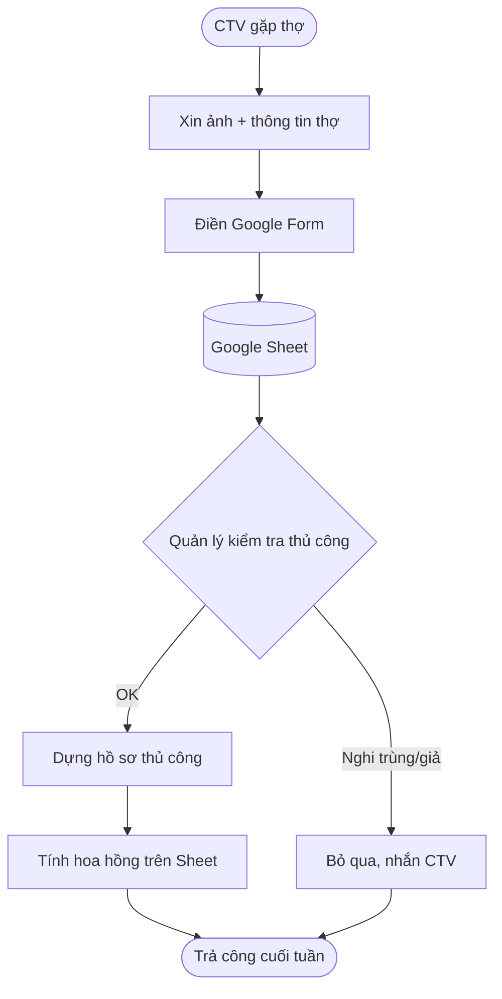
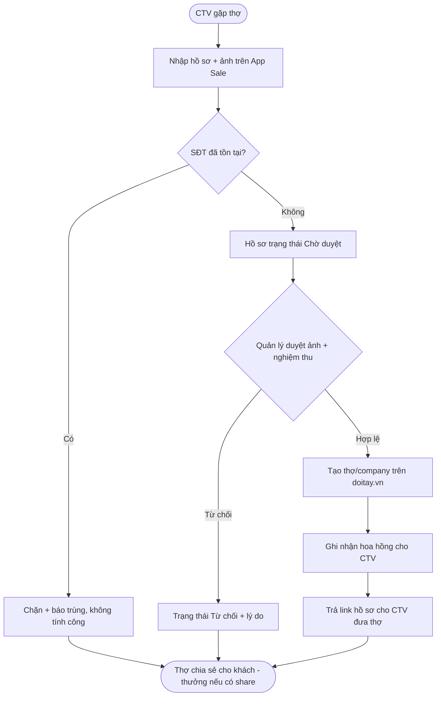
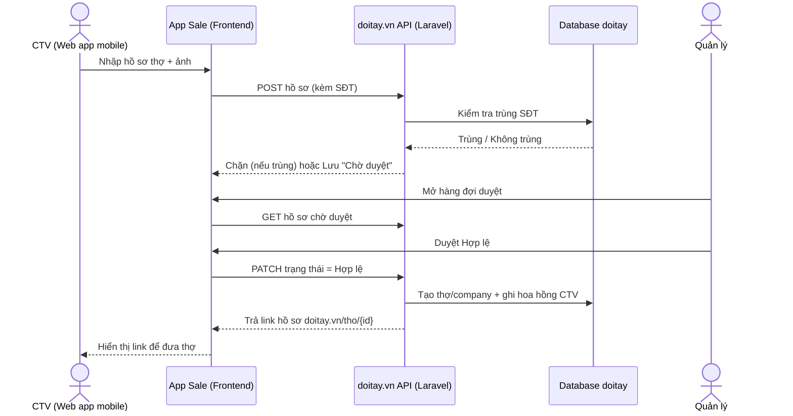
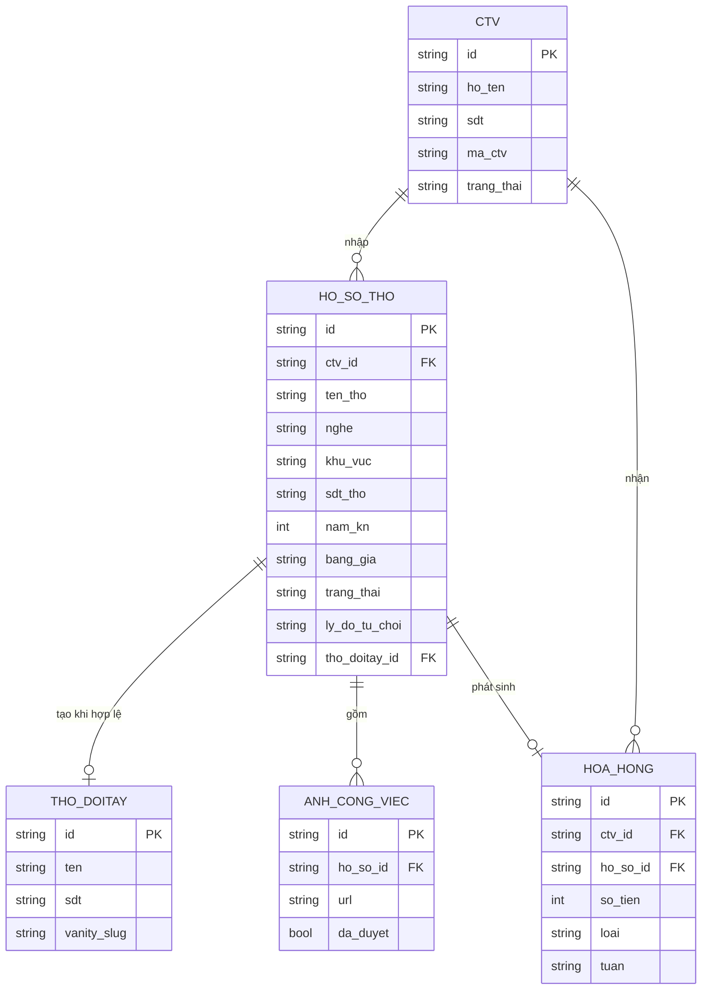

# Business Requirement: Ứng dụng Sale — CTV nhập & onboard thợ cho doitay.vn

**Document ID:** BREQ-SALE-CTV-ONBOARDING
**Date:** 2026-07-15
**Author:** Doitay Growth Team
**Status:** Draft

---

## Executive Summary

Doitay.vn đang ở giai đoạn 0 người dùng thật. Để phá vòng lặp con gà–quả trứng, chiến lược là gom **cung (thợ)** trước bằng cách để đội **Cộng tác viên (CTV)** đi kênh vật lý mời thợ tạo hồ sơ nghề miễn phí, sau đó thợ tự chia sẻ hồ sơ cho khách của họ (kéo **cầu**).

Hiện quy trình nhập liệu chạy tạm bằng Google Form + xử lý thủ công — không kiểm soát được trùng lặp, không tính hoa hồng tự động, không nghiệm thu ảnh, và không đưa thợ vào chợ doitay.vn ngay. Khi scale lên nhiều CTV, đây trở thành nút thắt.

BREQ này đề xuất một **Web app mobile cho đội Sale/CTV**: CTV nhập hồ sơ thợ (kèm ảnh) ngay trên điện thoại; quản lý duyệt ảnh + nghiệm thu; hệ thống chống trùng SĐT và tính hoa hồng tự động; và **ghi thẳng dữ liệu vào backend doitay.vn (Laravel)** để thợ hợp lệ xuất hiện trên chợ ngay — một nguồn dữ liệu duy nhất, không phân mảnh.

---

## 1. Business Context

### 1.1 Current State
- Chiến lược cold-start: gom thợ trước qua CTV đi kênh vật lý (cửa hàng vật tư, chợ, khu dân cư).
- Nhập liệu hiện tại: **Google Form → Google Sheet → dựng hồ sơ thủ công**.
- CTV trả công theo kết quả (hoa hồng/thợ hợp lệ), quản lý nghiệm thu thủ công.
- Dữ liệu thợ chưa tự vào chợ doitay.vn; có nguy cơ phân mảnh (ThợTốt Firebase vs doitay Laravel).

### 1.2 Business Objectives
- **O1 — Tốc độ onboard:** Rút thời gian từ "CTV thu thập" đến "thợ có trên chợ doitay.vn" xuống dưới 24 giờ.
- **O2 — Kiểm soát chi phí:** Chỉ trả hoa hồng cho hồ sơ HỢP LỆ đã xác minh; giảm gian lận về ~0.
- **O3 — Scale:** Cho phép vận hành 5–50 CTV song song mà quản lý vẫn nhẹ (chỉ duyệt + nghiệm thu).
- **O4 — Một nguồn dữ liệu:** Mọi thợ CTV nhập đều là bản ghi trên doitay.vn (không hệ rời rạc).

### 1.3 Stakeholders

| Stakeholder | Role | Interest/Impact |
| :---------- | :--- | :-------------- |
| CTV (Sale) | Người đi thu thập thợ | Cần nhập nhanh trên điện thoại, thấy rõ hồ sơ hợp lệ & hoa hồng của mình |
| Quản lý chương trình | Founder / vận hành | Duyệt ảnh, nghiệm thu, tính công, chống gian lận, xem hiệu suất từng CTV |
| Thợ | Đối tượng được nhập | Có hồ sơ nghề trên doitay.vn để gửi khách; SĐT được bảo mật |
| Khách của thợ | Cầu đầu tiên | Xem hồ sơ thợ qua link/QR, liên hệ thợ |
| Đội kỹ thuật doitay | Xây & vận hành | Tích hợp app sale với backend Laravel hiện có |

---

## 2. Problem Statement

Quy trình nhập liệu thủ công bằng Google Form không đủ để vận hành một đội CTV trả-theo-kết-quả ở quy mô lớn: không chống được khai khống/trùng lặp, không tính hoa hồng minh bạch, không nghiệm thu ảnh có kiểm soát, và không đưa thợ vào chợ doitay.vn tự động.

### 2.1 Pain Points
- **P1:** Không phát hiện trùng SĐT → 1 thợ bị khai nhiều lần, trả công sai.
- **P2:** Không có cơ chế duyệt ảnh → CTV có thể nộp ảnh trên mạng/ảnh giả.
- **P3:** Tính hoa hồng thủ công trên Sheet → tốn công quản lý, dễ sai, khó minh bạch với CTV.
- **P4:** Hồ sơ không tự vào doitay.vn → phải dựng lại thủ công, chậm, dễ sót.
- **P5:** Quản lý không thấy real-time hiệu suất từng CTV → khó tối ưu đội ngũ.

### 2.2 Business Impact
- Chi phí hoa hồng bị rò rỉ do khai khống/trùng (ước tính thất thoát 15–30% nếu không kiểm soát).
- Thời gian quản lý nghiệm thu thủ công tăng tuyến tính theo số CTV → chặn scale.
- Thợ vào chợ chậm → giảm tốc độ tạo cung → kéo dài giai đoạn cold-start.

---

## 3. Proposed Solution

### 3.1 Solution Overview
Một **Web app mobile** (mở bằng trình duyệt điện thoại, không cần cài đặt) cho 2 vai trò: **CTV** và **Quản lý**. CTV nhập hồ sơ thợ + ảnh ngay tại hiện trường; hệ thống **chống trùng SĐT tức thời**; Quản lý **duyệt ảnh + nghiệm thu**; khi hợp lệ, hệ thống **tạo hồ sơ thợ trên doitay.vn** và **ghi nhận hoa hồng** cho CTV. Toàn bộ ghi thẳng vào **backend Laravel doitay.vn** — một nguồn dữ liệu duy nhất.

### 3.2 Key Features/Capabilities
- Đăng nhập CTV theo SĐT + mã CTV; phân quyền CTV/Quản lý.
- Form nhập hồ sơ thợ tối ưu điện thoại (tên, nghề, khu vực, SĐT, năm KN, bảng giá, 3–5 ảnh công việc).
- **Chống trùng SĐT** ngay khi nhập.
- Hàng đợi **duyệt ảnh + nghiệm thu** cho Quản lý (hợp lệ / từ chối kèm lý do).
- **Tự tạo hồ sơ thợ trên doitay.vn** khi hồ sơ được duyệt hợp lệ.
- **Tính hoa hồng tự động** theo hồ sơ hợp lệ + thưởng khi thợ chia sẻ hồ sơ.
- Dashboard hiệu suất từng CTV; CTV tự xem hồ sơ & hoa hồng của mình.

### 3.3 Expected Benefits
- Giảm thất thoát hoa hồng do trùng/khống về gần 0 (chặn ở tầng dữ liệu).
- Thời gian onboard thợ < 24h; quản lý nghiệm thu nhanh hơn ~5–10x nhờ hàng đợi tập trung.
- Scale đội CTV mà chi phí quản lý gần như không tăng.
- Thợ hợp lệ có mặt trên chợ doitay.vn ngay → tăng tốc tạo cung.

### 3.4 Đồng bộ đa mặt tiền (một nguồn dữ liệu)
Sale nhập **một lần** vào doitay.vn. Dữ liệu thợ có **một nguồn duy nhất** (Laravel/MySQL), được hiển thị ở nhiều "mặt tiền":
- **Web:** trang công khai `doitay.vn/tho/{id}` (SEO, chia sẻ link).
- **ThợTốt (Zalo Mini App):** đọc hồ sơ thợ từ **API public của doitay.vn**, KHÔNG dùng Firebase làm kho dữ liệu.

ThợTốt trở thành "bản hiển thị trên Zalo" của hồ sơ thợ doitay, không phải app dữ liệu riêng. Nhờ vậy: sale nhập một lần → thợ xuất hiện đồng thời trên cả web doitay.vn lẫn ThợTốt, không đồng bộ chéo, không lệch dữ liệu.

```
App Sale (CTV) --GHI--> doitay.vn (Laravel/MySQL)  ← NGUỒN DUY NHẤT
                              |  (đọc qua API public)
              +---------------+----------------+
              v                                v
     doitay.vn/tho/{id}                ThợTốt (Zalo Mini App)
     (web, SEO)                        (đọc doitay API, bỏ Firebase)
```

---

## 4. Requirements

### 4.1 Functional Requirements

| ID | Priority | Requirement | Acceptance Criteria |
| :- | :------- | :---------- | :------------------ |
| FR-001 | Must Have | CTV đăng nhập bằng SĐT + mã CTV; hệ thống phân biệt vai trò CTV/Quản lý | Đăng nhập đúng vai trò; CTV chỉ thấy dữ liệu của mình |
| FR-002 | Must Have | CTV tạo hồ sơ thợ: tên, nghề, khu vực (quận/huyện), SĐT, năm KN, bảng giá, 3–5 ảnh công việc | Lưu được hồ sơ ở trạng thái "Chờ duyệt"; thiếu trường bắt buộc thì chặn |
| FR-003 | Must Have | Chống trùng SĐT: khi nhập SĐT đã tồn tại (thợ hoặc hồ sơ khác), báo ngay và chặn tạo trùng | Nhập SĐT trùng → hiện cảnh báo, không tạo bản ghi mới tính công |
| FR-004 | Must Have | Upload ảnh công việc trực tiếp từ điện thoại (chụp hoặc chọn từ máy) | Ảnh hiển thị trong hồ sơ; giới hạn số lượng & dung lượng |
| FR-005 | Must Have | Quản lý xem hàng đợi hồ sơ "Chờ duyệt", duyệt Hợp lệ hoặc Từ chối kèm lý do | Trạng thái hồ sơ cập nhật; CTV thấy kết quả + lý do |
| FR-006 | Must Have | Khi hồ sơ được duyệt Hợp lệ, hệ thống tạo hồ sơ thợ/company trên doitay.vn | Bản ghi thợ xuất hiện tại doitay.vn/tho/{id}; link trả về hồ sơ |
| FR-007 | Must Have | Tính hoa hồng tự động cho CTV theo mỗi hồ sơ Hợp lệ | Số hồ sơ hợp lệ × đơn giá = hoa hồng; hiển thị cho CTV & Quản lý |
| FR-008 | Must Have | CTV xem danh sách hồ sơ đã nộp + trạng thái + hoa hồng của mình | Danh sách lọc theo trạng thái; tổng hoa hồng đúng |
| FR-009 | Should Have | Ghi nhận thưởng khi thợ chia sẻ hồ sơ cho khách (theo dõi lượt xem/chia sẻ) | Có sự kiện share/view → cộng thưởng cho CTV |
| FR-010 | Should Have | Dashboard Quản lý: số hồ sơ, tỷ lệ hợp lệ/từ chối, tổng hoa hồng theo từng CTV & theo tuần | Số liệu khớp dữ liệu thực; lọc theo thời gian |
| FR-011 | Should Have | Xuất báo cáo hoa hồng theo tuần (để chuyển khoản) | Xuất được danh sách CTV + số tiền cần trả |
| FR-012 | Could Have | Thông báo cho CTV khi hồ sơ được duyệt/từ chối | CTV nhận thông báo trong app |
| FR-013 | Could Have | Nhập tạm khi mất mạng, đồng bộ khi có mạng lại | Hồ sơ nhập offline không mất, tự gửi khi online |
| FR-015 | Must Have | ThợTốt (Zalo Mini App) đọc hồ sơ thợ từ API public doitay.vn; bỏ Firebase làm nguồn dữ liệu | Mở ThợTốt xem thợ → dữ liệu khớp doitay.vn; app không đọc/ghi Firebase cho hồ sơ thợ |
| FR-016 | Must Have | doitay.vn cung cấp API public trả hồ sơ thợ đầy đủ (ảnh dự án, kỹ năng, bảng giá, đánh giá) đủ cho cả ThợTốt CV lẫn web | API trả đủ field để ThợTốt render CV không thiếu mục |
| FR-014 | Won't Have (v1) | Thợ nhận OTP xác minh SĐT | (Giai đoạn sau — v1 dùng chống trùng + duyệt ảnh) |

### 4.2 Non-Functional Requirements

| ID | Category | Requirement | Acceptance Criteria |
| :- | :------- | :---------- | :------------------ |
| NFR-001 | Performance | Nhập xong 1 hồ sơ (kể cả upload ảnh) dưới ~2 phút trên 4G | Đo thời gian thao tác thực tế ≤ 2 phút |
| NFR-002 | Usability | Giao diện tối ưu điện thoại, thao tác 1 tay, nút lớn, ít bước | CTV mới dùng được không cần training phần mềm |
| NFR-003 | Security | Phân quyền chặt: CTV không xem/sửa hồ sơ của CTV khác; dữ liệu thợ (SĐT) không lộ chéo | Kiểm thử truy cập chéo bị chặn |
| NFR-004 | Reliability | Ghi vào doitay.vn phải nhất quán (không tạo thợ trùng, không mất hồ sơ khi lỗi mạng) | Retry an toàn; không sinh bản ghi trùng |
| NFR-005 | Auditability | Mọi thay đổi trạng thái (duyệt/từ chối/tính công) được ghi log ai-làm-gì-khi-nào | Log truy vết đầy đủ cho đối soát |

### 4.3 Business Rules
- **BR-1:** 1 SĐT thợ = 1 bản ghi được tính công. Trùng SĐT không phát sinh hoa hồng lần 2.
- **BR-2:** Hồ sơ chỉ **Hợp lệ** khi: đủ trường bắt buộc + ≥3 ảnh công việc được Quản lý duyệt là thật + SĐT không trùng.
- **BR-3:** Hoa hồng chỉ tính trên hồ sơ **Hợp lệ**; hồ sơ Từ chối không tính công.
- **BR-4:** Chỉ khi hồ sơ Hợp lệ, hệ thống mới tạo thợ/company trên doitay.vn.
- **BR-5:** Thưởng chia sẻ chỉ tính khi có sự kiện thợ thật chia sẻ/khách xem hồ sơ.
- **BR-6:** CTV chỉ thao tác trên hồ sơ do chính mình tạo; Quản lý thấy toàn bộ.
- **BR-7:** Chỉ có MỘT nguồn dữ liệu thợ là doitay.vn. Mọi mặt tiền (web, ThợTốt Zalo) đều ĐỌC từ đó; không lưu bản sao dữ liệu thợ ở kho khác (Firebase).

---

## 5. Process Flow

### 5.1 Current Process (As-Is)



### 5.2 Proposed Process (To-Be)



---

## 6. System Interactions



---

## 7. Data Requirements

### 7.1 Data Entities



### 7.2 Data Quality Requirements
- SĐT thợ chuẩn hoá về 1 định dạng trước khi so trùng (bỏ khoảng trắng, +84 → 0).
- Ảnh công việc lưu kèm cờ `da_duyet`; chỉ ảnh đã duyệt mới tính vào điều kiện hợp lệ.
- Mỗi hoa hồng gắn với đúng 1 hồ sơ hợp lệ (không double-count).

---

## 8. Analysis

### 8.1 Gap Analysis

| Current State | Desired State | Gap | Solution |
| :------------ | :------------ | :-- | :------- |
| Google Form + Sheet | App sale chuyên dụng | Không chống trùng, không phân quyền | FR-001, FR-003 |
| Kiểm tra thủ công | Hàng đợi duyệt tập trung | Chậm, không audit | FR-005, NFR-005 |
| Dựng hồ sơ thủ công | Tự tạo thợ trên doitay.vn | Tốn công, dễ sót | FR-006 |
| Tính công trên Sheet | Hoa hồng tự động | Sai sót, thiếu minh bạch | FR-007, FR-010 |

### 8.2 Impact Assessment

| Stakeholder/Area | Impact Level | Description | Mitigation |
| :--------------- | :----------- | :---------- | :--------- |
| CTV | High | Đổi từ Google Form sang app; cần quen giao diện | UI đơn giản (NFR-002), không cần training phần mềm |
| Quản lý | High | Chuyển sang duyệt tập trung; giảm tải lớn | Hàng đợi + dashboard (FR-005, FR-010) |
| Đội kỹ thuật doitay | Medium | Thêm endpoint sale + tạo thợ từ hồ sơ | Tái dùng service/endpoint admin có sẵn |
| Thợ | Low | Không đổi trải nghiệm, chỉ được onboard nhanh hơn | — |

---

## 9. Success Criteria

| Metric | Current Value | Target Value | Measurement Method |
| :----- | :------------ | :----------- | :----------------- |
| Thời gian onboard 1 thợ (thu thập → lên chợ) | ~vài ngày (thủ công) | < 24 giờ | Chênh thời gian tạo hồ sơ → thợ hiển thị |
| Tỷ lệ hồ sơ trùng lọt qua | Không kiểm soát | < 1% | Đối soát SĐT trùng trong DB |
| Chi phí quản lý / 100 hồ sơ | Cao (thủ công) | Giảm ≥ 70% | Giờ công quản lý bỏ ra |
| Số CTV vận hành song song | ~vài | 5–50 | Số CTV hoạt động/tuần |
| Số thợ thật hợp lệ / tuần | 0 (giai đoạn 0) | 30 tuần đầu, tăng dần | Đếm hồ sơ Hợp lệ |

---

## 10. Constraints & Assumptions

### 10.1 Constraints
- Tái dùng **backend doitay.vn (Laravel/MySQL)** hiện có; không xây backend mới.
- App sale là **web mobile** (không native, không phụ thuộc duyệt store/Zalo).
- v1 **không dùng OTP**; xác minh bằng chống trùng SĐT + duyệt ảnh thủ công.
- Ngân sách hoa hồng biến đổi (chỉ trả khi có hồ sơ hợp lệ).

### 10.2 Assumptions
- CTV có điện thoại + 4G, biết chụp/chọn ảnh.
- Thợ đồng ý cho CTV nhập SĐT + ảnh công việc (đã có ở kịch bản chào thợ).
- Backend doitay.vn có/đưa được endpoint tạo thợ từ hồ sơ (tái dùng nhóm admin/seed đã scaffold).

---

## 11. Risks

| Risk | Probability | Impact | Mitigation Strategy |
| :--- | :---------- | :----- | :------------------ |
| CTV khai khống ảnh giả | Medium | High | Bắt buộc duyệt ảnh (BR-2); từ chối kèm lý do; theo dõi tỷ lệ từ chối theo CTV |
| Trùng SĐT do định dạng khác nhau | Medium | Medium | Chuẩn hoá SĐT trước khi so trùng (7.2) |
| CTV không quen app, quay lại Google Form | Medium | Medium | UI cực đơn giản; onboard 1 buổi; đo tỷ lệ dùng |
| Ghi lỗi vào doitay.vn tạo thợ trùng | Low | High | Idempotent theo SĐT; retry an toàn (NFR-004) |
| Thất thoát hoa hồng do lỗi tính | Low | Medium | Hoa hồng gắn 1-1 với hồ sơ hợp lệ + log đối soát |

---

## 12. Implementation Approach

### 12.1 Recommended Phases
1. **Phase 1 — Nhập & chống trùng (MVP):** FR-001..004 + BR-1. CTV nhập hồ sơ + ảnh, chặn trùng SĐT, lưu "Chờ duyệt". *(Thay thế Google Form.)*
2. **Phase 2 — Duyệt & lên chợ:** FR-005, FR-006 + BR-2..4. Quản lý duyệt ảnh/nghiệm thu; hồ sơ hợp lệ tạo thợ trên doitay.vn.
3. **Phase 3 — Hoa hồng & dashboard:** FR-007, FR-008, FR-010, FR-011. Tính công tự động + báo cáo tuần.
4. **Phase 4 — Tối ưu:** FR-009 (thưởng share), FR-012 (thông báo), FR-013 (offline).

### 12.2 Dependencies
- Endpoint/Service tạo thợ trên backend doitay.vn (tái dùng nhóm admin đã có).
- Cơ chế lưu ảnh (storage) trên hạ tầng doitay hiện tại.
- Danh mục nghề & địa bàn (quận/huyện) từ API public doitay.vn.

---

## 13. Appendices

### 13.1 Glossary
- **CTV:** Cộng tác viên — người đi kênh vật lý mời & nhập thợ, trả công theo kết quả.
- **Hồ sơ (thợ):** Bản ghi thông tin + ảnh 1 thợ do CTV nhập, có vòng đời trạng thái.
- **Hồ sơ Hợp lệ:** Hồ sơ đủ điều kiện tính công & tạo thợ trên doitay.vn (BR-2).
- **Hoa hồng:** Tiền trả CTV theo hồ sơ hợp lệ + thưởng share.

### 13.2 References
- `doitay-vn/docs/business/requirements/headless-migration.md` — BREQ nền tảng doitay.vn.
- `agent-system/playbooks/tuyen_30_tho_dau_tien.md` — kịch bản chào & thu thập thợ.
- `agent-system/playbooks/thue_ctv_tuyen_tho.md` — mô hình thuê CTV & chống gian lận.
- `doitay-vn/CLAUDE.md` — kiến trúc backend Laravel + API v1.
