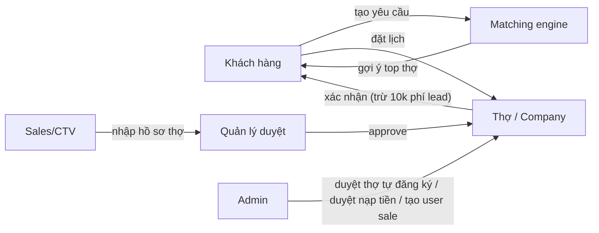
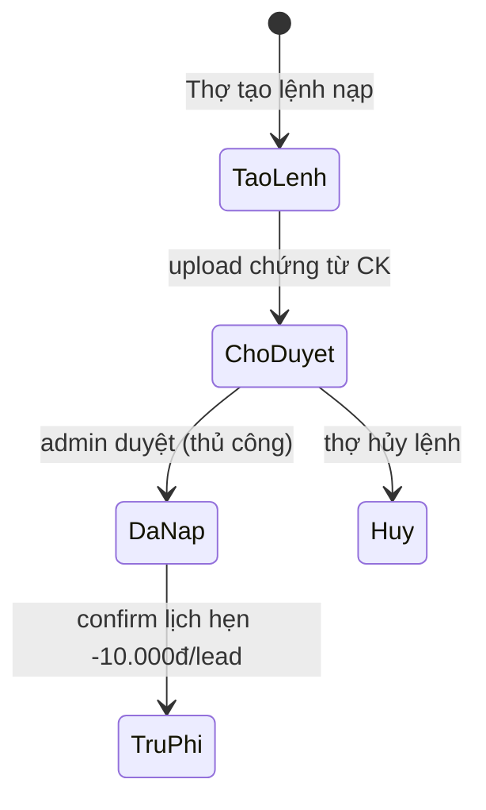

# Phân tích vận hành nền tảng doitay.vn — Khách · Thợ · Sales

> Tài liệu phân tích TOÀN BỘ luồng vận hành thực tế (trace từ code production ngày 2026-07-18,
> branch `rebuild/headless-nextjs`) cho 3 vai trò: **Khách hàng**, **Thợ**, **Sales/CTV**,
> kèm đánh giá điểm gãy và đề xuất cải thiện theo ưu tiên.
>
> Nguồn trace: `routes/api/v1_*.php`, `ServiceRequestService`, `AppointmentService`,
> `WalletService`, `SubmissionService`, `SubmissionReviewService`, `CommissionService`,
> frontend `src/app/**`. Không suy đoán — mọi mô tả đều bám code.

---

## 1. Tổng quan mô hình

doitay.vn là **marketplace 2 chiều + kênh sales offline**:

**Mô hình doanh thu hiện tại:** duy nhất **phí lead 10.000đ** trừ ví công ty khi thợ
xác nhận lịch hẹn (mở khóa SĐT khách). Không phí hoa hồng trên giá trị việc. Nạp ví
bằng chuyển khoản thủ công (admin duyệt).

---

## 2. Luồng KHÁCH HÀNG

### 2.1 Hành trình chuẩn (happy path)

| # | Bước | Màn hình | API | Trạng thái |
|---|------|----------|-----|------------|
| 1 | Đăng ký (email hoặc SĐT) | `/dang-ky` | `POST /auth/register` | user `status=1` |
| 2 | Hoàn thành hồ sơ (username, SĐT, địa chỉ) | `/vi/hoan-thanh-ho-so` | `POST /user/complete-profile` | `profile_complete=1` |
| 3 | Tạo yêu cầu (4 bước: nghề → mô tả ≥20 ký tự → địa điểm → liên hệ) | `/yeu-cau` | `POST /user/service-requests` | request `open` → `matched` |
| 4 | Xem danh sách thợ được match (rank theo rating + việc hoàn thành) | `/yeu-cau/ket-qua/{id}` | `GET /user/service-requests/{id}` | — |
| 5 | Chọn thợ → đặt lịch (ngày giờ, địa chỉ) | `/tho/{id}?from_request=` | `POST /user/appointments` | appointment `pending` |
| 6 | Chờ thợ xác nhận | `/vi/lich-hen` | — | `pending → confirmed` |
| 7 | Thợ làm việc, đánh dấu hoàn thành | — | (thợ gọi complete) | `confirmed → completed` |
| 8 | Đánh giá thợ (sao + tiêu chí theo nghề) | `/vi/lich-hen/{id}` | `POST /user/appointments/{id}/review` | rating công khai |

Ghi chú thiết kế tốt đang có:
- Guest **được điền form** `/yeu-cau`, chỉ chặn ở bước GỬI (needsLogin) — giữ conversion.
- Chống spam: tối đa `MAX_OPEN_PER_USER_24H` yêu cầu `open`/24h; dedup theo nội dung.
- Notify 2 chiều (in-app + email template) ở mọi bước lịch hẹn: tạo/xác nhận/hoàn thành/hủy.

### 2.2 Nhánh phụ
- **Hủy lịch:** khách chỉ hủy được khi `pending`. Sau khi thợ đã `confirmed` (đã mất 10k) khách **không có nút hủy** → phải gọi điện; không có luồng hoàn phí cho thợ (xem §7-P2).
- **Đặt lịch trực tiếp** không qua yêu cầu: vào `/tho`, chọn thợ, đặt lịch thẳng — hợp lệ.
- **Gọi thẳng thợ:** SĐT thợ **public** trên trang hồ sơ (`phone` trong `CompanyDetailResource`, nút `tel:`) → khách có thể bỏ qua toàn bộ luồng đặt lịch (xem §7-P1 leakage).

---

## 3. Luồng THỢ

### 3.1 Hành trình chuẩn

| # | Bước | Màn hình | API / Ai xử lý | Trạng thái |
|---|------|----------|----------------|------------|
| 1 | Đăng ký, chọn vai "Thợ / Chuyên gia" | `/dang-ky` | `POST /auth/register` (pending_role cache 30 ngày) | user |
| 2 | Hoàn thành hồ sơ cá nhân | `/vi/hoan-thanh-ho-so` | `POST /user/complete-profile` | `profile_complete=1` |
| 3 | Đăng ký hồ sơ thợ 4 bước (thông tin, nghề, giá dịch vụ, ảnh + địa bàn) | `/vi/tho/dang-ky` | `POST /user/companies` | company `PENDING` |
| 4 | **CHỜ ADMIN DUYỆT** (thủ công, admin legacy `/admin`) | — | Admin | `PENDING → APPROVED` |
| 5 | Hồ sơ hiện công khai, được matching | `/tho/{id}` | — | — |
| 6 | **Nạp ví** (bắt buộc trước khi nhận việc): tạo lệnh → chuyển khoản → upload chứng từ → **admin duyệt** | `/vi/nap-tien` | `POST /user/deposits` + proof | deposit pending → approved |
| 7 | Nhận lịch hẹn `pending` → bấm **Xác nhận** → ví bị trừ **10.000đ** (hardcode), mở khóa SĐT khách | `/vi/tho/lich-hen` | `POST /user/tho/appointments/{id}/confirm` | `pending → confirmed` |
| 8 | Làm việc → bấm **Hoàn thành** | `/vi/tho/lich-hen/{id}` | `.../complete` | `confirmed → completed` |
| 9 | Nhận đánh giá → tăng rank matching | — | — | — |

### 3.2 Nhánh phụ / điều kiện chặn
- Ví **chưa tồn tại** → không xác nhận được lịch (DomainException "tạo ví trước").
- Ví **không đủ 10k** → debit fail → không xác nhận được → lịch kẹt `pending`.
- Thợ hủy lịch `pending` được; sau `confirmed` không có luồng hủy/hoàn phí.
- Kênh song song: thợ do **CTV nhập** (luồng §4) được approve **thẳng** không qua bước 1–4.
- Zalo Mini App "Hồ Sơ Thợ" (CV + QR) là công cụ acquisition cho thợ — đang chờ Zalo duyệt.

---

## 4. Luồng SALES / CTV

### 4.1 Hành trình chuẩn

| # | Bước | Màn hình | API | Trạng thái |
|---|------|----------|-----|------------|
| 0 | **Admin tạo tài khoản sale** (không tự đăng ký) | `/admin` | — | user thường |
| 1 | Đăng nhập cổng riêng | `/sale/login` | `POST /auth/login` | — |
| 2 | Nhập hồ sơ thợ: tên, SĐT (dedup normalize), nghề, giá, 3–5 ảnh việc | `/sale/nhap` | `POST /sale/submissions` | submission `pending` |
| 3 | Theo dõi trạng thái + hoa hồng của mình | `/sale` | `GET /sale/submissions` (+meta counts, tổng hoa hồng) | — |
| 4 | **Quản lý** (user_id trong `SALE_MANAGER_USER_IDS`) duyệt | `/sale/duyet` | `PATCH /admin/submissions/{id}/approve\|reject` | `pending → approved/rejected` |
| 5 | Approve ⇒ tự tạo **User + Company APPROVED** + ghi **hoa hồng** (idempotent) | — | `SubmissionReviewService` | commission ghi nhận |

**Hoa hồng (config `sale.php`, đọc từ env):** cơ bản `SALE_COMMISSION_BASE=30.000đ`/hồ sơ duyệt
+ thưởng chia sẻ `SALE_COMMISSION_SHARE_BONUS=10.000đ`. Reject phải kèm lý do — CTV thấy để sửa.

### 4.2 Điểm dừng hiện tại
- Hoa hồng mới **ghi nhận số liệu**, **chưa có luồng chi trả** (payout/đối soát/lịch sử thanh toán).
- Quyền duyệt cấu hình bằng env `SALE_MANAGER_USER_IDS` — đổi người duyệt phải sửa env + cache lại (không có UI).

---

## 5. Luồng TIỀN (ví & phí)

- Ví gắn theo **company** (không theo user) → khách hàng thuần không có ví (đã ẩn menu ví khỏi khách).
- Phí lead **10.000đ hardcode** trong `AppointmentService` (`$leadFee = 10000;`).
- Giao dịch có khóa (debitWithLock) + ghi transaction `customer_info_access` — chống race, có vết.

---

## 6. Bảng vòng đời trạng thái

| Thực thể | Trạng thái | Chuyển tiếp | Ai thao tác |
|---|---|---|---|
| ServiceRequest | `open → matched` | tạo → match xong | hệ thống |
| Appointment | `pending → confirmed → completed`; `pending → canceled` | đặt → thợ xác nhận (trừ phí) → thợ hoàn thành; khách/thợ hủy khi pending | khách/thợ |
| Company | `PENDING → APPROVED` (hoặc APPROVED thẳng qua CTV) | admin / quản lý sale | admin/QL |
| Submission (sale) | `pending → approved / rejected(+lý do)` | quản lý duyệt | QL sale |
| Deposit | `pending → approved / canceled` | admin duyệt CK | admin |

⚠️ Thiếu trạng thái: request không có `expired/converted`; appointment không có `no_show/disputed`.

---

## 7. ĐÁNH GIÁ — điểm gãy vận hành & cải thiện (theo ưu tiên)

> **Cập nhật 2026-07-18 — ĐÃ TRIỂN KHAI & verify trên production:**
> ✅ P0.1 notify thợ khi match (in-app, top-5) · ✅ P0.2 tặng **200.000đ** vào ví khi duyệt hồ sơ
> (cả 2 đường duyệt, idempotent) · ✅ P0.3 hàng đợi vận hành tại `/sale/duyet` ·
> ✅ P1.1 che SĐT thợ public (env `SHOW_CONTACT_PUBLIC`) · ✅ P1.2 phí lead vào config
> (`marketplace.lead_fee`, env `LEAD_FEE`) · ✅ P1.3 duyệt thợ tự đăng ký hợp nhất về `/sale/duyet` + checklist.
> Còn lại: P1.4 (nạp tự động — cần tài khoản cổng), nhóm P2.
> Phát hiện thêm khi triển khai: prod thiếu model + bảng `service_requests` (đã deploy + migrate —
> **luồng yêu cầu dịch vụ trên production trước giờ chưa từng chạy được**).

### 🔴 P0 — gãy vòng lặp cốt lõi (làm ngay)

**P0.1 — Thợ KHÔNG được thông báo khi được match yêu cầu.**
`ServiceRequestService` không có bất kỳ `notify()` nào. Matching chỉ trả danh sách cho
KHÁCH xem; nếu khách không chủ động đặt lịch, yêu cầu chết im lặng — thợ không bao giờ
biết mình vừa được match. Đây là nửa vòng lặp marketplace đang thiếu.
→ **Sửa:** sau `matchCompanies()`, notify top-N thợ ("Có khách cần {nghề} tại {quận}") qua
in-app + email; về sau thêm Zalo OA/SMS. Cân nhắc cho thợ chủ động "nhận việc" (2 chiều).

**P0.2 — Onboarding thợ gãy tại ví 0đ.**
Thợ mới duyệt xong, nhận lịch đầu tiên → bấm xác nhận → fail vì ví 0đ → phải nạp CK thủ
công → chờ admin duyệt → khách bên kia chờ mòn mỏi. Khả năng cao mất cả thợ lẫn khách ở
đúng giao dịch đầu tiên.
→ **Sửa:** tặng **credit chào mừng** (vd 50.000đ = 5 lead) khi company được duyệt, hoặc miễn
phí N lead đầu. Đồng thời cảnh báo số dư thấp ngay trên dashboard thợ.

**P0.3 — Không ai trực "yêu cầu đang mở".**
Không có view vận hành nào đếm request `open`/appointment `pending` quá hạn. Yêu cầu rơi
vào hư không nếu 2 bên không tự hành động.
→ **Sửa:** dashboard admin tối thiểu: request open >24h, appointment pending >24h, deposit
chờ duyệt — kèm nhắc tự động (nhắc thợ xác nhận sau 4h, gợi ý khách chọn thợ khác sau 24h).

### 🟠 P1 — thất thu & vận hành thủ công

**P1.1 — Lộ SĐT thợ → bypass phí lead (leakage).**
`CompanyDetailResource` trả `phone` public + nút "Gọi thợ ngay" `tel:` trên trang hồ sơ.
Khách gọi thẳng, không đặt lịch → nền tảng mất 10k phí VÀ mất dấu giao dịch (không rating,
không dữ liệu). Mô hình phí lead hiện tại gần như tự nguyện.
→ **Quyết định sản phẩm cần chốt:** (a) che SĐT, chỉ hiện sau khi đặt lịch (bảo vệ doanh
thu, thêm ma sát), hoặc (b) giai đoạn cold-start chấp nhận lộ số để tối đa kết nối, thu phí
sau khi có thói quen. Khuyến nghị: **(b) hiện tại, chuyển (a) khi ≥30% lịch hẹn/tuần đến từ nền tảng** — nhưng phải đo được (thêm nút "Gọi" có tracking event).

**P1.2 — Phí lead hardcode 10.000đ trong code.**
Vi phạm nguyên tắc repo (không hardcode config). Muốn đổi giá/khuyến mãi phải sửa code + deploy.
→ **Sửa:** chuyển vào `general_settings`/config env, admin chỉnh được.

**P1.3 — Hai cửa duyệt thợ song song, không SLA.**
Thợ tự đăng ký → duyệt ở admin legacy; thợ CTV nhập → duyệt ở `/sale/duyet`. Hai người
duyệt khác nhau, không checklist chung, không cam kết thời gian ("24h làm việc" đang hứa ở
trang trở-thành-thợ nhưng không ai đo).
→ **Sửa:** hợp nhất hàng đợi duyệt về một màn hình; checklist duyệt (ảnh thật? SĐT gọi
được? giá hợp lý?); đo SLA duyệt.

**P1.4 — Nạp tiền thủ công 2 bước chờ.**
CK → upload chứng từ → admin duyệt. Chậm và không scale.
→ **Sửa (lộ trình):** tích hợp cổng tự động (VietQR động + webhook bank, hoặc Casso/SePay)
— ví được cộng tức thì.

### 🟡 P2 — hoàn thiện để scale

- **P2.1 Payout hoa hồng sale:** thêm trạng thái `paid/unpaid`, kỳ chi trả, lịch sử — hiện mới ghi nhận số.
- **P2.2 Hoàn phí lead:** khách bùng sau khi thợ đã confirm → thợ mất 10k oan; cần nút "khách không đến" + chính sách refund (admin xét).
- **P2.3 Trạng thái thiếu:** request `expired` (tự đóng sau 7 ngày), appointment `no_show`, `disputed`.
- **P2.4 Kênh thông báo:** notify hiện in-app + email; thợ VN ít đọc email → Zalo OA / web push (PWA) / SMS cho sự kiện tiền + lịch hẹn.
- **P2.5 Quản lý sale bằng env:** chuyển `SALE_MANAGER_USER_IDS` sang bảng role trong DB + UI admin.
- **P2.6 Đổi trạng thái hồ sơ thợ:** thợ không thấy "vì sao chưa được duyệt/bị từ chối" — thêm lý do + notify.

### ✅ Điểm vận hành đang TỐT (giữ)
- Notify 2 chiều đầy đủ ở mọi chuyển trạng thái lịch hẹn.
- Chống spam yêu cầu (limit/24h + dedup), matching re-run được, không thu tiền lúc match.
- Trừ phí có lock + transaction log; approve submission idempotent (không double hoa hồng).
- Sale flow tách cổng riêng, reject có lý do; guest điền được form yêu cầu.
- Auth email/SĐT đã thông suốt (fix 7/2026); crash Lịch hẹn/Ví đã sửa.

---

## 8. KPI vận hành cần theo dõi (tuần)

| Nhóm | KPI | Mục tiêu ban đầu |
|---|---|---|
| Cung | Thợ được duyệt mới / SLA duyệt | ≥10/tuần · <24h |
| Cầu | Yêu cầu tạo mới · % matched → đặt lịch | đo baseline · ≥30% |
| Khớp lệnh | % pending → confirmed <4h · % completed | ≥60% · ≥80% |
| Doanh thu | Lead fee thu/tuần · số ví hết tiền khi confirm | đo · →0 |
| Sales | Hồ sơ CTV nhập · % duyệt · hoa hồng phát sinh | theo chiến dịch |
| Trải nghiệm | Rating TB · % lịch bị hủy | ≥4.5 · <15% |

---

## 9. Thứ tự triển khai đề xuất

1. **Tuần này (P0):** notify thợ khi match · credit chào mừng 50k · trang admin đếm hàng đợi (open/pending/deposit).
2. **Tuần 2–3 (P1):** lead fee vào settings · tracking nút gọi · hợp nhất + checklist duyệt thợ.
3. **Tháng tới (P2):** payout hoa hồng · auto nạp tiền (VietQR webhook) · trạng thái expired/no-show · Zalo OA notify.

*Tài liệu này là snapshot 2026-07-18 — cập nhật khi luồng thay đổi.*
