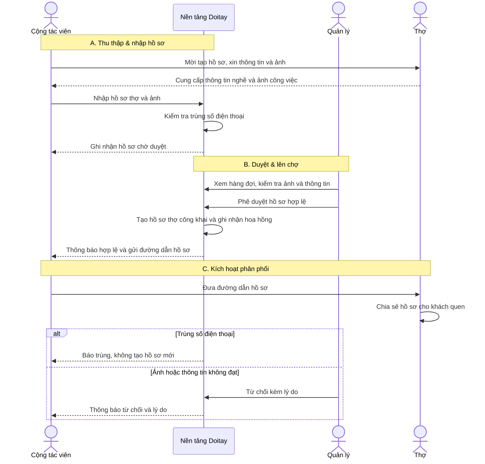

# BUC-SALE-CTV-ONBOARDING: Onboard thợ qua Cộng tác viên

**Use Case ID:** BUC-SALE-CTV-ONBOARDING
**Use Case Name:** Onboard thợ qua Cộng tác viên (CTV nhập → duyệt → lên chợ → tính công)
**Version:** 1.0
**Date:** 2026-07-15
**Status:** Draft

---

## Brief Description

Quy trình để đội **Cộng tác viên (CTV)** đưa thợ thật vào doitay.vn: CTV gặp thợ ngoài thực địa, thu thập thông tin và ảnh công việc, nhập vào hệ thống; **Quản lý** duyệt tính xác thực; khi hợp lệ, thợ có mặt trên nền tảng và CTV được ghi nhận hoa hồng.

Use case phục vụ chiến lược cold-start (gom cung trước): mỗi thợ được onboard là một nguồn cung thật, đồng thời là một kênh phân phối nhỏ khi thợ chia sẻ hồ sơ cho khách của họ. Người hưởng lợi: CTV (thu nhập theo kết quả), Quản lý (kiểm soát chất lượng & chi phí), thợ (có hồ sơ nghề miễn phí), doitay.vn (tăng cung nhanh, chi phí thấp).

> **Phạm vi:** Use case này mô tả luồng onboard phía doitay.vn. Việc hiển thị hồ sơ thợ trên nhiều mặt tiền (web + ThợTốt) là mối quan tâm song song, phần chuyển ThợTốt đọc dữ liệu doitay hiện **đang hoãn** — xem `docs/backlog.md → DEFERRED-001`.

---

## Actors

| Actor | Type | Description |
|-------|------|-------------|
| **Cộng tác viên (CTV)** | Primary | Đi thực địa mời & thu thập thợ, nhập hồ sơ; hưởng hoa hồng theo hồ sơ hợp lệ |
| **Quản lý chương trình** | Primary | Duyệt tính xác thực (ảnh, thông tin), nghiệm thu, phê duyệt tính công |
| **Thợ** | Supporting | Cung cấp thông tin nghề + ảnh công việc; nhận hồ sơ để chia sẻ cho khách |
| **Nền tảng Doitay** | System | Kiểm tra trùng lặp, lưu trạng thái, tạo hồ sơ thợ, ghi nhận hoa hồng |

---

## Preconditions

1. CTV đã được cấp tài khoản và mã CTV, đang đăng nhập.
2. Thợ đồng ý cung cấp thông tin nghề và ảnh công việc thật.
3. Nền tảng Doitay đang hoạt động và sẵn sàng nhận hồ sơ.

---

## Postconditions

### Success Postconditions
1. Hồ sơ thợ được tạo trên nền tảng ở trạng thái công khai (thợ có mặt trên chợ).
2. Hoa hồng được ghi nhận cho đúng CTV, gắn với hồ sơ hợp lệ.
3. CTV nhận được đường dẫn hồ sơ thợ để đưa lại cho thợ chia sẻ.

### Failure Postconditions
1. Không tạo hồ sơ thợ trùng lặp; không phát sinh hoa hồng khống.
2. Hồ sơ bị từ chối được ghi nhận kèm lý do; CTV được thông báo.
3. Thao tác dở dang không để lại dữ liệu một-phần (toàn vẹn).

---

## Main Success Scenario

### Sequence Diagram



### Step-by-Step Flow

| Step | Actor | Action | Details |
|------|-------|--------|---------|
| **1** | **Cộng tác viên** | Thu thập thông tin thợ | • Xin **tên**, **nghề**, **khu vực**<br>• Xin **số điện thoại** liên hệ<br>• Xin **số năm kinh nghiệm**, **bảng giá** (nếu có)<br>• Xin **3–5 ảnh công việc** thật |
| **2** | **Cộng tác viên** | Nhập hồ sơ | • Điền các thông tin đã thu thập<br>• Đính kèm ảnh công việc |
| **3** | **Nền tảng Doitay** | Kiểm tra & ghi nhận | • Kiểm tra **trùng số điện thoại**<br>• Nếu không trùng: lưu hồ sơ ở trạng thái **Chờ duyệt**<br>• Báo lại kết quả cho CTV |
| **4** | **Quản lý** | Nghiệm thu | • Mở hàng đợi hồ sơ chờ duyệt<br>• Kiểm tra ảnh có thật, thông tin đầy đủ<br>• Quyết định **Hợp lệ** hoặc **Từ chối** |
| **5** | **Nền tảng Doitay** | Lên chợ & tính công | • Tạo **hồ sơ thợ công khai**<br>• Ghi nhận **hoa hồng** cho CTV (gắn 1-1 với hồ sơ hợp lệ)<br>• Trả **đường dẫn hồ sơ** cho CTV |
| **6** | **Cộng tác viên** | Kích hoạt phân phối | • Đưa đường dẫn cho thợ<br>• Dặn thợ **chia sẻ cho khách quen** |

---

## Alternative Flows

### Alternative Flow 1: Trùng số điện thoại
**Trigger:** Step 3 — Số điện thoại thợ đã tồn tại trong hệ thống.

**Flow:**
- 3a. Nền tảng phát hiện số điện thoại đã có (thợ hoặc hồ sơ khác).
- 3b. Nền tảng chặn tạo hồ sơ mới, báo CTV "đã tồn tại".
- 3c. Không phát sinh hoa hồng cho lần nhập này. Kết thúc use case.

---

### Alternative Flow 2: Quản lý từ chối hồ sơ
**Trigger:** Step 4 — Ảnh không thật hoặc thông tin thiếu/không hợp lệ.

**Flow:**
- 4a. Quản lý chọn Từ chối và ghi lý do.
- 4b. Hồ sơ chuyển trạng thái Từ chối; không tạo thợ, không tính công.
- 4c. CTV nhận thông báo kèm lý do để bổ sung/sửa. Kết thúc hoặc CTV nhập lại (quay về Step 2).

---

## Exception Flows

### Exception 1: Thiếu thông tin bắt buộc
**Trigger:** Step 2 — CTV chưa điền đủ trường bắt buộc hoặc chưa đủ số ảnh tối thiểu.

**Flow:**
- Nền tảng phát hiện thiếu và không cho gửi.
- CTV được chỉ rõ trường còn thiếu.
- CTV bổ sung rồi gửi lại. Use case tiếp tục ở Step 3.

### Exception 2: Mất kết nối khi nhập
**Trigger:** Step 2 — CTV mất mạng khi đang nhập ngoài thực địa.

**Flow:**
- Hồ sơ đang nhập không bị mất (giữ tạm).
- Khi có kết nối lại, CTV gửi lại; hệ thống không tạo bản trùng. Use case tiếp tục ở Step 3.

---

## Business Rules

### BR1: Một số điện thoại — một thợ tính công
- **Rule:** Mỗi số điện thoại thợ chỉ ứng với một hồ sơ được tính công. Trùng số không phát sinh hoa hồng lần hai.
- **Rationale:** Chống khai khống/trùng lặp làm rò rỉ chi phí hoa hồng.
- **Enforcement:** Kiểm tra trùng tại Step 3.

### BR2: Điều kiện hồ sơ Hợp lệ
- **Rule:** Hồ sơ chỉ Hợp lệ khi đủ thông tin bắt buộc, có tối thiểu 3 ảnh công việc được Quản lý xác nhận là thật, và số điện thoại không trùng.
- **Rationale:** Đảm bảo chất lượng thợ và độ tin cậy của chợ.
- **Enforcement:** Nghiệm thu tại Step 4.

### BR3: Hoa hồng chỉ tính trên hồ sơ Hợp lệ
- **Rule:** Chỉ hồ sơ được phê duyệt Hợp lệ mới phát sinh hoa hồng; hồ sơ bị từ chối không tính công.
- **Rationale:** Trả theo kết quả thật, gắn trách nhiệm chất lượng cho CTV.
- **Enforcement:** Ghi nhận hoa hồng tại Step 5.

### BR4: Chỉ tạo thợ khi Hợp lệ
- **Rule:** Hồ sơ thợ công khai chỉ được tạo khi hồ sơ được duyệt Hợp lệ.
- **Rationale:** Không đưa dữ liệu chưa kiểm chứng lên chợ.
- **Enforcement:** Tạo hồ sơ tại Step 5.

### BR5: Thưởng chia sẻ theo hành động thật
- **Rule:** Thưởng chia sẻ chỉ tính khi có hành động thợ thật chia sẻ/khách xem hồ sơ.
- **Rationale:** Khuyến khích đúng mục tiêu (kéo cầu), tránh thưởng khống.
- **Enforcement:** Ghi nhận khi có sự kiện chia sẻ.

### BR6: CTV chỉ thao tác hồ sơ của mình
- **Rule:** CTV chỉ xem/sửa hồ sơ do chính mình nhập; Quản lý thấy toàn bộ.
- **Rationale:** Bảo mật dữ liệu và tránh tranh chấp hoa hồng.
- **Enforcement:** Phân quyền theo vai trò.

---

## Data Requirements

### Input Data

| Field | Type | Required | Validation | Example |
|-------|------|----------|------------|---------|
| Tên thợ | String | Yes | Không rỗng | "Vũ Hùng" |
| Nghề | String | Yes | Thuộc danh mục nghề | "Thợ điện" |
| Khu vực | String | Yes | Quận/huyện hợp lệ | "Cầu Giấy, Hà Nội" |
| Số điện thoại | String | Yes | Định dạng VN, không trùng (BR1) | "0972585990" |
| Số năm kinh nghiệm | Number | No | ≥ 0 | 3 |
| Bảng giá | List | No | Mỗi mục có tên + giá | [{"Kiểm tra": "150.000"}] |
| Ảnh công việc | List<Image> | Yes | 3–5 ảnh, định dạng ảnh | [ảnh1, ảnh2, ảnh3] |

### Output Data

**Hồ sơ thợ (công khai):**
```json
{
  "id": "ma-tho",
  "ten": "Vũ Hùng",
  "nghe": "Thợ điện",
  "khu_vuc": "Cầu Giấy, Hà Nội",
  "duong_dan": "doitay.vn/tho/{id}",
  "trang_thai": "cong-khai"
}
```

**Hoa hồng:**
```json
{
  "ctv": "ma-ctv",
  "ho_so": "ma-ho-so",
  "so_tien": 30000,
  "loai": "co-ban",
  "tuan": "2026-W29"
}
```

---

## Success Criteria

1. **Onboard đúng & nhanh**
   - Thợ hợp lệ có mặt trên chợ trong vòng 24 giờ kể từ khi nhập.
   - Không tạo thợ trùng (BR1, BR4).
2. **Chi phí đúng**
   - Hoa hồng chỉ phát sinh trên hồ sơ hợp lệ (BR3), gắn đúng CTV.
3. **Kiểm soát chất lượng**
   - Mọi hồ sơ đều qua nghiệm thu (Step 4); hồ sơ giả bị từ chối kèm lý do.
4. **Kích hoạt phân phối**
   - CTV nhận được đường dẫn hồ sơ để đưa thợ chia sẻ (Step 5–6).

---

## Acceptance Criteria

### Functional Acceptance Criteria

**AC1: Nhập hồ sơ**
- ✅ CTV nhập được hồ sơ với đủ trường bắt buộc + 3–5 ảnh.
- ✅ Thiếu trường bắt buộc hoặc thiếu ảnh → chặn gửi, chỉ rõ chỗ thiếu.

**AC2: Chống trùng**
- ✅ Nhập số điện thoại đã tồn tại → báo trùng, không tạo hồ sơ mới, không tính công.

**AC3: Duyệt & lên chợ**
- ✅ Quản lý duyệt Hợp lệ → thợ xuất hiện công khai; CTV nhận đường dẫn.
- ✅ Quản lý Từ chối → hồ sơ Từ chối kèm lý do; không tạo thợ, không tính công.

**AC4: Hoa hồng**
- ✅ Mỗi hồ sơ hợp lệ ghi đúng một khoản hoa hồng cho đúng CTV (không double-count).

### Non-Functional Acceptance Criteria

**AC5: Usability**
- ✅ CTV nhập xong 1 hồ sơ (kể cả ảnh) trong ~2 phút trên điện thoại.
- ✅ Thông báo lỗi rõ ràng, chỉ được cách sửa.

**AC6: Reliability & Integrity**
- ✅ Thao tác lên chợ + tính công là toàn vẹn (tất-cả-hoặc-không).
- ✅ Gửi lại khi mất mạng không tạo bản trùng.

**AC7: Security**
- ✅ CTV không xem/sửa được hồ sơ của CTV khác (BR6).
- ✅ Không lộ dữ liệu nội bộ (trạng thái duyệt, lý do, hoa hồng) cho người ngoài.

---

## Required Domain Operations

> Các Domain UC cần có để hiện thực hoá workflow này (tạo placeholder rồi bổ sung sau).

| Step | Domain UC | Aggregate | Link |
|------|-----------|-----------|------|
| 3 | Tạo hồ sơ thợ (submission) + chống trùng | ThoSubmission | [DUC-SUBMISSION-CREATE](../domain/tho_submission/create.md) |
| 3 | Liệt kê hồ sơ của CTV | ThoSubmission | [DUC-SUBMISSION-LIST](../domain/tho_submission/list.md) |
| 4 | Từ chối hồ sơ kèm lý do | ThoSubmission | [DUC-SUBMISSION-REJECT](../domain/tho_submission/reject.md) |
| 5 | Duyệt hồ sơ → tạo thợ công khai | ThoSubmission, Company | [DUC-SUBMISSION-APPROVE](../domain/tho_submission/approve.md) |
| 5 | Ghi nhận hoa hồng | Commission | [DUC-COMMISSION-RECORD](../domain/commission/record.md) |

*Tạo bidirectional traceability giữa BUC và các Domain UC.*

---

## Related Use Cases

- **BUC-SALE-CTV-ONBOARDING** bổ sung cho chiến lược tăng cung trong **BREQ-SALE-CTV-ONBOARDING**.
- Hồ sơ thợ tạo ra dùng lại use case công khai hiện có: **[DUC-COMPANY-SHOW-PUBLIC](../domain/company/show-public.md)** (hiển thị hồ sơ thợ trên web & ThợTốt).

---

## References

- **BREQ:** [sale_ctv_onboarding_app.md](../../business/requirements/sale_ctv_onboarding_app.md)
- **Design kỹ thuật:** [sale_ctv_onboarding_multi_surface.md](../../architecture/designs/sale_ctv_onboarding_multi_surface.md)
- **Backlog:** [backlog.md → DEFERRED-001](../../backlog.md)
- **Kịch bản thực địa:** `agent-system/playbooks/tuyen_30_tho_dau_tien.md`, `thue_ctv_tuyen_tho.md`

---

## Notes

### Implementation Considerations
1. **Nghiệm thu tập trung:** hàng đợi duyệt cho Quản lý để scale nhiều CTV mà tải quản lý không tăng tuyến tính.
2. **Chuẩn hoá số điện thoại** trước khi so trùng (chi tiết kỹ thuật ở design §4.3).
3. **Đa mặt tiền (hoãn):** hiển thị hồ sơ trên ThợTốt dùng chung nguồn dữ liệu doitay — xem DEFERRED-001.

---

**Document Version:** 1.0
**Last Updated:** 2026-07-15
**Next Review:** Sau khi duyệt BUC → chuyển sang Domain UC (DUC) và implement-tests
