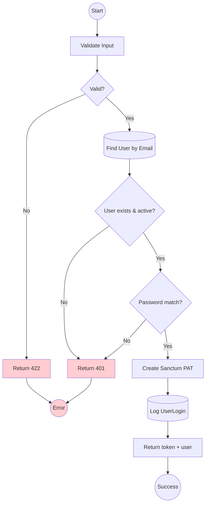

# DUC-AUTH-LOGIN: Login User

## Brief Description

Authenticate user bằng email + password. Trả về Sanctum Personal Access Token để frontend lưu trong httpOnly cookie và dùng cho subsequent requests.

## Entity Definition

See **[User](../../../architecture/domains/auth.md#user)** in domain model.

**Key fields:**
- `email` (required, string, valid email)
- `password` (required, string, min 6)

## Actors

| Actor | Type | Description |
|---|---|---|
| **Public visitor** | Primary | Người dùng đã đăng ký, đang đăng nhập |
| **AuthController (Api/V1)** | System | Xử lý login |
| **Sanctum** | System | Phát hành PAT |

## Preconditions

1. User đã tồn tại trong DB (`users` table) với `status = active`.
2. Request gửi `Content-Type: application/json` và `Accept: application/json`.

## Postconditions

### Success
1. PAT được tạo trong `personal_access_tokens` (Sanctum).
2. Response trả về `{ token: string, user: UserResource }`.
3. (Optional) Log `UserLogin` record với IP + user agent.

### Failure
1. Không tạo token.
2. Trả về `422` (validation) hoặc `401` (sai credentials).

## Flows

### Flow Diagram



### Main Success Flow

| Step | Component | Action | Details |
|---|---|---|---|
| 1 | AuthController | Receive | `POST /api/v1/auth/login` với `{email, password}` |
| 2 | LoginRequest | Validate | email required+valid, password required+min:6 |
| 3 | AuthService | Find user | `User::where('email', $email)->where('status','active')` |
| 4 | AuthService | Check password | `Hash::check($password, $user->password)` |
| 5 | AuthService | Create token | `$user->createToken('frontend', ['*'])` |
| 6 | AuthService | Log login | `UserLogin::create(['user_id', 'ip', 'user_agent'])` |
| 7 | AuthController | Return | `{ token: $plainText, user: new UserResource($user) }` |

### Exception Flows

#### EF1: Validation failure
**Trigger:** email/password thiếu hoặc sai format
| Step | Component | Details |
|---|---|---|
| 2a | LoginRequest | Trả `422` với `{message, errors: {email|password: [...]}}` |

#### EF2: Invalid credentials
**Trigger:** không tìm thấy user hoặc password sai
| Step | Component | Details |
|---|---|---|
| 3a/4a | AuthService | Trả `401` với `{message: "Email hoặc mật khẩu không đúng"}` (tránh leak info) |

#### EF3: User inactive
**Trigger:** `user.status != 'active'`
| Step | Component | Details |
|---|---|---|
| 3b | AuthService | Trả `403` với `{message: "Tài khoản chưa được kích hoạt"}` |

## Business Rules

| Rule | Description | Enforcement |
|---|---|---|
| BR-LOGIN-1 | Không tiết lộ "email không tồn tại" hay "sai password" — luôn trả message thống nhất | Step 3a/4a |
| BR-LOGIN-2 | PAT abilities mặc định là `['*']` cho frontend SPA | Step 5 |
| BR-LOGIN-3 | Phải log mỗi lần login thành công cho audit | Step 6 |
| BR-LOGIN-4 | Rate limit `throttle:5,1` (5 attempt / phút / IP) | Middleware route |

## Data Requirements

### Input
| Field | Type | Required | Validation |
|---|---|---|---|
| email | string | Yes | email, exists trong logic |
| password | string | Yes | min:6 |

### Output (200)
```json
{
  "token": "1|abcdef...",
  "user": {
    "id": 123,
    "name": "Nguyễn Văn A",
    "email": "a@example.com",
    "avatar": "https://...",
    "role": "user"
  }
}
```

## Acceptance Criteria

| AC | Description |
|---|---|
| AC1 | POST với email+password hợp lệ → 200 + token + user |
| AC2 | Email sai format → 422 |
| AC3 | Email không tồn tại → 401 với message thống nhất |
| AC4 | Password sai → 401 với message thống nhất (không phân biệt với AC3) |
| AC5 | User inactive → 403 |
| AC6 | Token trả về dùng được cho `GET /api/v1/auth/me` |
| AC7 | UserLogin record được tạo sau login thành công |
| AC8 | Quá 5 attempt sai trong 1 phút → 429 |

## Related Domain UCs

- [DUC-AUTH-ME](./me.md)
- [DUC-AUTH-LOGOUT](./logout.md)
- [DUC-AUTH-REGISTER](./register.md)

## References

- **Domain Model:** [auth.md](../../../architecture/domains/auth.md)
- **API Endpoint:** `POST /api/v1/auth/login`
- **Controller:** `App\Http\Controllers\Api\V1\AuthController@login`
- **FormRequest:** `App\Http\Requests\V1\Auth\LoginRequest`
- **Resource:** `App\Http\Resources\V1\User\UserResource`
