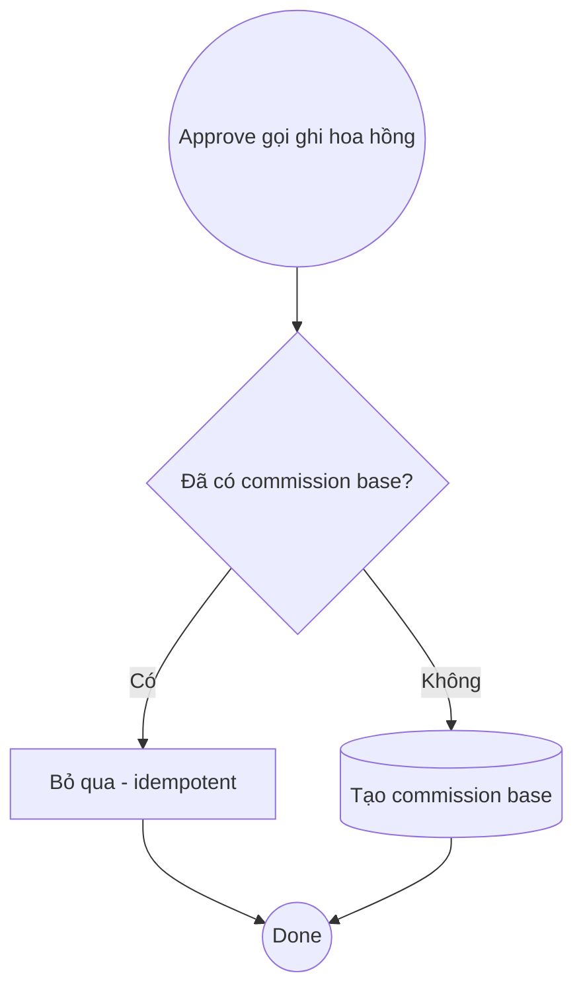

# DUC-COMMISSION-RECORD: Record Commission

> **Phase 3** — chưa implement ở Phase 1. Tài liệu để traceability.

## Brief Description

Khi một submission được duyệt Hợp lệ, ghi một khoản hoa hồng cho đúng CTV, gắn 1-1 với submission đó. Chống double-count khi retry.

## Entity — Commission (key fields)

| Field | Type | Required | Description |
|---|---|---|---|
| ctv_id | int (FK users) | Yes | CTV hưởng hoa hồng |
| submission_id | int (FK, unique) | Yes | Gắn 1-1 với hồ sơ hợp lệ |
| so_tien | int | Yes | Số tiền (VND) |
| loai | enum(base/share_bonus) | Yes | Loại hoa hồng |
| tuan | string | Yes | Tuần chốt (vd 2026-W29) |

## Actors
- **System** (gọi nội bộ từ approve)
- **CommissionService**

## Preconditions
1. Submission ở trạng thái `approved`.
2. Chưa tồn tại commission `base` cho submission này.

## Postconditions
### Success
1. Tạo `commissions` (loai=base) cho CTV.
### Failure
1. Không tạo trùng nếu đã có commission cho submission (idempotent).

## Flow

### Main Success Flow
| Step | Component | Action |
|---|---|---|
| 1 | Service | Nhận `submission` đã approved |
| 2 | Service | Kiểm tra commission `base` chưa tồn tại cho submission |
| 3 | Service | Tạo commission (so_tien theo đơn giá cấu hình, tuan hiện tại) |

## Business Rules
| Rule | Description |
|---|---|
| BR-COMM-1 | Mỗi submission hợp lệ → tối đa 1 commission `base` (unique submission_id) |
| BR-COMM-2 | Chỉ tính trên submission approved (BR-3 của BUC) |
| BR-COMM-3 | Thưởng `share_bonus` ghi riêng khi có sự kiện share (BR-5 của BUC) |

## Acceptance Criteria
| AC | Description |
|---|---|
| AC1 | Approve → tạo đúng 1 commission base cho đúng CTV |
| AC2 | Gọi lại (retry) → không tạo commission thứ 2 |
| AC3 | so_tien khớp đơn giá cấu hình |

## Supports Business UCs
- [BUC-SALE-CTV-ONBOARDING](../../business/sale-ctv-onboarding.md)

## Related Domain UCs
- [DUC-SUBMISSION-APPROVE](../tho_submission/approve.md)

## References
- Service: `App\Services\CommissionService@recordFor`
