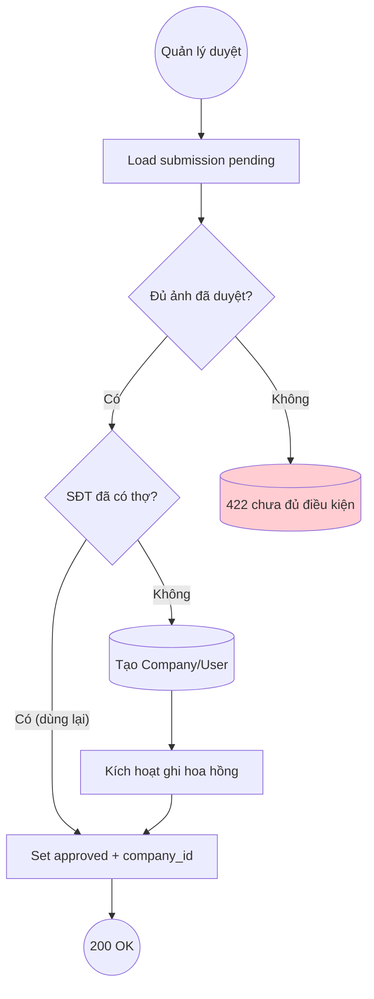

# DUC-SUBMISSION-APPROVE: Approve Submission → Create Public Thợ

> **Phase 2** — chưa implement ở Phase 1. Tài liệu để traceability.

## Brief Description

Quản lý duyệt một submission `pending` là **Hợp lệ**: hệ thống tạo hồ sơ thợ công khai (tái dùng `CompanyCreationService`), đánh dấu ảnh đã duyệt, và kích hoạt ghi hoa hồng (DUC-COMMISSION-RECORD). Idempotent theo SĐT để tránh tạo thợ trùng.

## Actors
- **Quản lý** (auth:sanctum + admin)
- **Admin/SubmissionReviewController**
- **CompanyCreationService** (tái dùng)

## Preconditions
1. Submission `pending`, có ≥3 ảnh được đánh dấu thật.
2. SĐT chưa ứng với thợ đã onboard (idempotency).

## Postconditions
### Success
1. Tạo `companies` + (nếu cần) `users` cho thợ; submission `approved`, gắn `company_id`.
2. Kích hoạt ghi hoa hồng cho CTV.
### Failure
1. 404 nếu không tồn tại; 422 nếu không `pending` hoặc chưa đủ ảnh duyệt.

## Flow

### Main Success Flow
| Step | Component | Action |
|---|---|---|
| 1 | Controller | `PATCH /api/v1/admin/submissions/{id}/approve` |
| 2 | Service | Kiểm submission `pending` + đủ ảnh duyệt (BR-2 của BUC) |
| 3 | Service | `DB::transaction`: `CompanyCreationService` tạo thợ (idempotent SĐT) |
| 4 | Service | Ghi hoa hồng (DUC-COMMISSION-RECORD) |
| 5 | Service | Set submission `approved` + `company_id` |
| 6 | Controller | Return SubmissionResource kèm `duong_dan` (doitay.vn/tho/{id}) |

## Exception Flows
- **EF1**: Không tồn tại → 404.
- **EF2**: Không `pending` → 422.
- **EF3**: Chưa đủ ảnh được duyệt → 422.

## Business Rules
| Rule | Description |
|---|---|
| BR-SUB-A1 | Chỉ tạo thợ khi hợp lệ (BR-4 của BUC) |
| BR-SUB-A2 | Idempotent theo SĐT — không tạo thợ trùng (NFR-004) |
| BR-SUB-A3 | Toàn vẹn: tạo thợ + hoa hồng trong 1 transaction |

## Acceptance Criteria
| AC | Description |
|---|---|
| AC1 | Duyệt pending đủ ảnh → 200, tạo thợ, submission approved, có hoa hồng |
| AC2 | Duyệt khi thiếu ảnh duyệt → 422 |
| AC3 | Duyệt 2 lần (retry) → không tạo thợ trùng, không double hoa hồng |
| AC4 | Response trả `duong_dan` doitay.vn/tho/{id} |

## Supports Business UCs
- [BUC-SALE-CTV-ONBOARDING](../../business/sale-ctv-onboarding.md)

## Related Domain UCs
- [DUC-SUBMISSION-CREATE](./create.md)
- [DUC-COMMISSION-RECORD](../commission/record.md)
- [DUC-COMPANY-SHOW-PUBLIC](../company/show-public.md)

## References
- API: `PATCH /api/v1/admin/submissions/{id}/approve`
- Tái dùng: `App\Services\CompanyCreationService`
