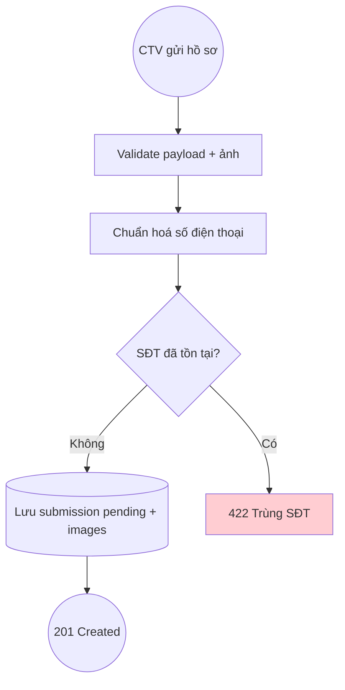

# DUC-SUBMISSION-CREATE: Create Thợ Submission

## Brief Description

CTV (đã đăng nhập) nhập một hồ sơ thợ (tên, nghề, khu vực, SĐT, năm KN, bảng giá, 3–5 ảnh). Hệ thống **chuẩn hoá SĐT** và **chống trùng**; nếu hợp lệ, tạo bản ghi ở trạng thái `pending`. Đây là thao tác nền tảng của Phase 1 (thay Google Form).

## Entity — ThoSubmission (key fields)

| Field | Type | Required | Description |
|---|---|---|---|
| ctv_id | int (FK users) | Yes | CTV tạo hồ sơ (owner) |
| ten_tho | string | Yes | Tên thợ |
| nghe | string | Yes | Nghề chính |
| khu_vuc | string | Yes | Quận/huyện + tỉnh |
| sdt_tho | string | Yes | SĐT gốc như CTV nhập |
| sdt_normalized | string (unique) | Yes | SĐT chuẩn hoá dùng để chống trùng |
| nam_kn | int | No | Năm kinh nghiệm |
| bang_gia | json | No | Danh sách dịch vụ + giá |
| status | enum(pending/approved/rejected) | Yes | Mặc định `pending` |
| images[] | SubmissionImage | Yes | 3–5 ảnh công việc |

## Actors
- **CTV** (auth:sanctum)
- **Sale/SubmissionController**

## Preconditions
1. CTV đã đăng nhập (token hợp lệ).
2. Payload đủ trường bắt buộc + 3–5 ảnh.

## Postconditions
### Success
1. Tạo `tho_submissions` (status=pending) + các `submission_images`.
### Failure
1. 422 nếu thiếu trường/ảnh không hợp lệ.
2. 422 nếu SĐT (đã chuẩn hoá) trùng — không tạo bản ghi mới.

## Flow



### Main Success Flow
| Step | Component | Action |
|---|---|---|
| 1 | Controller | `POST /api/v1/sale/submissions` (multipart) |
| 2 | FormRequest | Validate trường bắt buộc + `images` 3–5 ảnh |
| 3 | Service | `normalizePhone(sdt_tho)` (+84→0, bỏ ký tự thừa) |
| 4 | Service | Kiểm tra trùng `sdt_normalized` trong `tho_submissions` chưa bị rejected |
| 5 | Service | `DB::transaction` tạo submission (pending) + lưu ảnh |
| 6 | Controller | Return `new SubmissionResource($submission)` (201) |

## Exception Flows
- **EF1**: Thiếu trường bắt buộc / <3 ảnh → 422.
- **EF2**: `sdt_normalized` trùng submission còn hiệu lực → 422 "SĐT đã tồn tại".

## Business Rules
| Rule | Description |
|---|---|
| BR-SUB-1 | SĐT chuẩn hoá là unique cho submission còn hiệu lực (BR-1 của BUC) |
| BR-SUB-2 | Số ảnh 3–5; ảnh là image, ≤3MB |
| BR-SUB-3 | `ctv_id` = người đăng nhập; không cho set thủ công |
| BR-SUB-4 | Trạng thái khởi tạo luôn `pending` |
| BR-SUB-5 | (Phase 2) Chống trùng mở rộng: so cả với thợ đã onboard (users/companies) ở bước approve |

## Data Requirements

### Input (multipart)
```
ten_tho, nghe, khu_vuc, sdt_tho, nam_kn?, bang_gia?[], images[] (3-5)
```
### Output (201)
```json
{ "data": { "id": 12, "ten_tho": "Vũ Hùng", "nghe": "Thợ điện",
  "khu_vuc": "Cầu Giấy, Hà Nội", "sdt_tho": "0972585990",
  "status": "pending", "so_anh": 3, "created_at": "..." } }
```

## Acceptance Criteria
| AC | Description |
|---|---|
| AC1 | Payload hợp lệ + 3 ảnh → 201, status=pending |
| AC2 | Thiếu trường bắt buộc → 422 |
| AC3 | <3 hoặc >5 ảnh → 422 |
| AC4 | SĐT trùng (kể cả khác định dạng: "+84972585990" vs "0972585990") → 422 |
| AC5 | `ctv_id` gán theo token, không theo input |

## Supports Business UCs
- [BUC-SALE-CTV-ONBOARDING](../../business/sale-ctv-onboarding.md)

## Related Domain UCs
- [DUC-SUBMISSION-LIST](./list.md)
- [DUC-SUBMISSION-APPROVE](./approve.md)

## References
- API: `POST /api/v1/sale/submissions`
- Controller: `App\Http\Controllers\API\V1\Sale\SubmissionController@store`
- Service: `App\Services\SubmissionService@create`
- Resource: `App\Http\Resources\V1\Sale\SubmissionResource`
