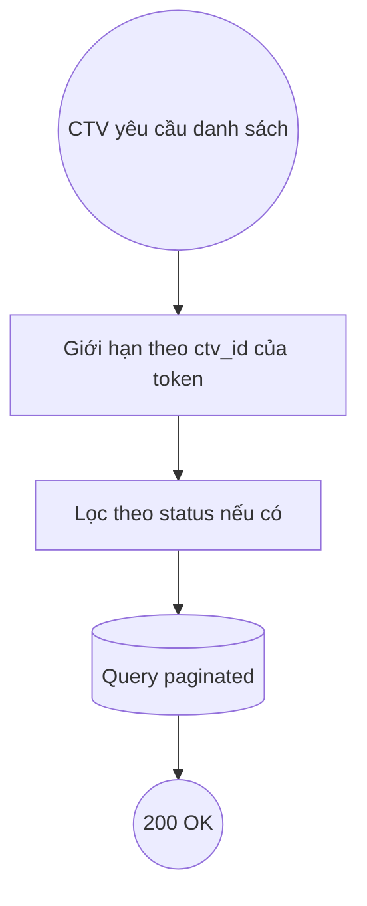

# DUC-SUBMISSION-LIST: List My Submissions

## Brief Description

CTV xem danh sách hồ sơ **do chính mình** nhập, kèm trạng thái (pending/approved/rejected) và lý do từ chối nếu có. Hỗ trợ lọc theo trạng thái + phân trang.

## Actors
- **CTV** (auth:sanctum)
- **Sale/SubmissionController**

## Preconditions
1. CTV đã đăng nhập.

## Postconditions
### Success
1. Trả danh sách submission của CTV (paginated), mới nhất trước.

## Flow



### Main Success Flow
| Step | Component | Action |
|---|---|---|
| 1 | Controller | `GET /api/v1/sale/submissions?status=&per_page=` |
| 2 | Service/Query | `ThoSubmission::where('ctv_id', auth id)` + filter status + `latest()` + paginate |
| 3 | Controller | Return `SubmissionResource::collection(...)` + meta |

## Exception Flows
- (Không có exception nghiệp vụ; danh sách rỗng vẫn 200.)

## Business Rules
| Rule | Description |
|---|---|
| BR-SUB-L1 | CTV CHỈ thấy submission của mình (BR-6 của BUC) |
| BR-SUB-L2 | `per_page` giới hạn 1–50 |

## Data Requirements
### Input
```
status? (pending|approved|rejected), per_page? (1-50)
```
### Output (200)
```json
{ "data": [ { "id": 12, "ten_tho": "...", "status": "pending", "ly_do_tu_choi": null } ],
  "meta": { "current_page": 1, "last_page": 1, "per_page": 20, "total": 1 } }
```

## Acceptance Criteria
| AC | Description |
|---|---|
| AC1 | Trả đúng submission của CTV đăng nhập |
| AC2 | KHÔNG trả submission của CTV khác |
| AC3 | Lọc `status=pending` chỉ trả pending |
| AC4 | Danh sách rỗng → 200 + data:[] |

## Supports Business UCs
- [BUC-SALE-CTV-ONBOARDING](../../business/sale-ctv-onboarding.md)

## Related Domain UCs
- [DUC-SUBMISSION-CREATE](./create.md)

## References
- API: `GET /api/v1/sale/submissions`
- Controller: `App\Http\Controllers\API\V1\Sale\SubmissionController@index`
