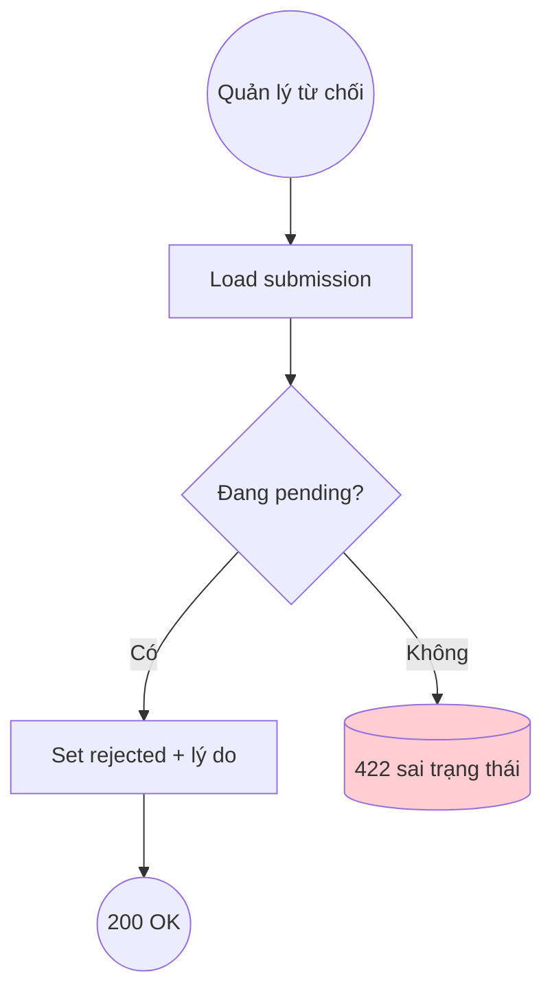

# DUC-SUBMISSION-REJECT: Reject Submission

> **Phase 2** — chưa implement ở Phase 1. Tài liệu để traceability.

## Brief Description

Quản lý từ chối một submission `pending` kèm **lý do**. Hồ sơ chuyển `rejected`; không tạo thợ, không phát sinh hoa hồng. CTV thấy lý do để sửa/nhập lại.

## Actors
- **Quản lý** (auth:sanctum + admin)
- **Admin/SubmissionReviewController**

## Preconditions
1. Submission tồn tại, đang `pending`.
2. Người gọi có quyền quản lý.

## Postconditions
### Success
1. `status = rejected`, lưu `ly_do_tu_choi`.
### Failure
1. 404 nếu không tồn tại; 422 nếu không ở trạng thái `pending`.

## Flow

### Main Success Flow
| Step | Component | Action |
|---|---|---|
| 1 | Controller | `PATCH /api/v1/admin/submissions/{id}/reject` (body: `ly_do`) |
| 2 | Service | Load submission `pending`; set `rejected` + `ly_do_tu_choi` |
| 3 | Controller | Return SubmissionResource |

## Exception Flows
- **EF1**: Không tồn tại → 404.
- **EF2**: Không `pending` → 422.

## Business Rules
| Rule | Description |
|---|---|
| BR-SUB-R1 | Chỉ từ chối submission đang `pending` |
| BR-SUB-R2 | `ly_do` bắt buộc, tối thiểu vài ký tự |
| BR-SUB-R3 | Từ chối KHÔNG phát sinh hoa hồng (BR-3 của BUC) |

## Acceptance Criteria
| AC | Description |
|---|---|
| AC1 | Từ chối pending kèm lý do → 200, status=rejected |
| AC2 | Từ chối submission đã approved → 422 |
| AC3 | Thiếu lý do → 422 |

## Supports Business UCs
- [BUC-SALE-CTV-ONBOARDING](../../business/sale-ctv-onboarding.md)

## Related Domain UCs
- [DUC-SUBMISSION-APPROVE](./approve.md)

## References
- API: `PATCH /api/v1/admin/submissions/{id}/reject`
